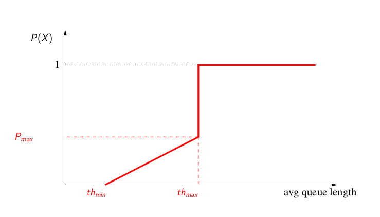
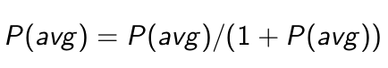

**Quelques rappels du cours**

Les files d'attente RED ont été introduites pour résoudre certains problèmes de TCP en présence de  files d'attente DropTail (i.e. FIFO buffer), par exemple :

* Réduire les oscillations de la file d'attente;
* Réduire la longueur moyenne de la file d'attente;
* Empêcher la synchronisation, qui apparaı̂t dans les files de type Drop Tail, car lorsque la file est pleine, plusieurs connexions perdent des paquets en même temps. La synchronisation créée des oscillations;
* Permettre aux rafales courtes de passer sans que la taille de la file d'attente augmente beaucoup;
* Contrôler la taille moyenne de la file afin de diminuer le délai moyen.

Le principe algorithmique est le suivant :

* RED calcule une valeur moyenne *avg* de la taille de la file d'attente et vérifie que cette moyenne se trouve entre un seuil *th_min* et un seuil maximal *th_max* comme illustré ci-dessus;
* Si c'est le cas alors un paquet qui arrive est rejeté (ou marqué) avec une proba *P = P(avg)*. *P* est croissante;
* Tous les paquets arrivant quand *avg >= th_max* sont rejetés;
* Quand la file moyennée varie entre *th_min* et *th_max* , *P_b* varie linéairement entre 0 et une valeur *P_max* :

* *P_b* est utilisée pour *P(avg)* si à l'arrivée du paquet précédent, *avg > th_min*. Sinon :

* Pour calculer l’évolution de la file moyennée, on initialise le paramètre *avg* à zéro;
* A chaque paquet qui arrive, *avg* est modifié selon *(1 − Wq ).avg + q.Wq* où *q* est la valeur instantanée de la file d'attente et *Wq* est une constante petite;
* Si la file se vide, on utilise une autre formule pour mettre à jour la valeur moyenne. Elle prend en compte : (1) Le temps écoulé depuis que la file s'est vidée; (2) une estimation sur le nombre des paquets qui auraient pu être transmis durant ce temps;
* Enfin pour calculer ce dernier, le simulateur a besoin d’une estimation de la taille moyenne d’un paquet.

Lorsque le flag ECN est activité, la file ne jette pas le paquet aléatoirement sélectionné mais le marque afin d'indiquer à la source TCP (après report de cette marque lors de son arrivée à destination dans les acquittements émis). Sous ns-2, cette fonctionnalité est activée avec`Agent/TCP/Linux set ecn_ 1` ou avec `Agent/TCP set ecn_ 1`
en fonction de la version de TCP. Puis au niveau du routeur RED `Queue/RED set setbit_ true` afin d'activer le marquage.

**Questions**

Téléchargez le script suivant : [aqm.zip](data/aqm.zip) qui contient une séquence permettant de tracer la courbe du taux d'occupation d'une file d'attente instantané et moyen en fonction du temps. Décompressez les trois fichiers de cet archive dans le même répertoire puis lancez le script TCL en tapant, par exemple : `ns aqm.tcl red`. Tapez `ns aqm.tcl` pour afficher les options possibles. 

Avant de commencer : prenez bien le temps de __lire et comprendre__ ce que fait ce script. Vous pouvez lancer les différentes version de RED proposées dans ce script afin d'avoir un aperçu de leurs performances. Changer les valeurs des seuils min et max et la valeur de la probabilité pour en comprendre l'impact. 

1. Modifiez le script afin de n'avoir plus qu'un nombre constant de 50 flots TCP/Newreno durant une la simulation de 100sec. Utilisez les valeurs de configuration de RED données dans le script original. Calculez et tracez le nombre de paquets jetés de la file d'attente en fonction du temps pour RED et ARED uniquement;
2. Prenez un flot au hasard parmi les 50 et tracez sa fenêtre de congestion. Proposez un calcul statistique (moyenne et écart type, min, max, fréquence des variations, ...) de l'évolution de la fenêtre;
3. Effectuez la même expérimentation en y ajoutant le flag ECN;
4. Concluez quant aux résultats obtenus.
