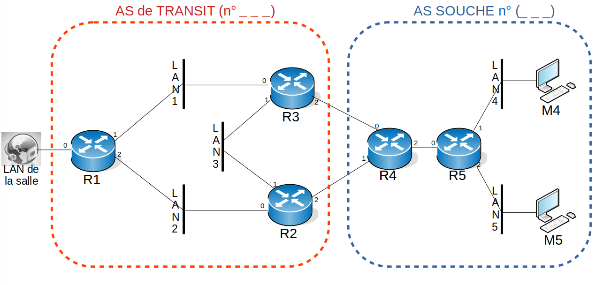

Ce document est sous licence Creative Creative Commons <br>
Attribution - Pas d’Utilisation Commerciale - Partage dans les Mêmes Conditions 3.0 France <br>
Merci de prendre connaissance de vos droits ici : [CC BY-NC-SA 3.0 FR](https://creativecommons.org/licenses/by-nc-sa/3.0/fr/)

# Objectifs du TP
1. Comprendre le fonctionnement de BGP
2. Comprendre une configuration simple de BGP pour un AS de transit
3. Comprendre une configuration simple de BGP pour un AS souche

# Présentation du TP

Ce TP a pour but d'illustrer le fonctionnement de BGP dans un cas simple mais néanmoins réaliste. Afin de créer un topologie intéressante et de permettre à chacun de manipuler et d'obtenir la maitrise de la configuration du protocole, nous avons fait le choix d'utiliser des machines virtuelles pour ce TP. Nous utiliserons donc comme pour le TP sur OSPF l'émulateur Pynetem. 

# 1 Topologie

Chaque binôme administrera deux AS, l'un sera un AS de transit offrant une connectivité à l'autre AS, qui sera donc un AS souche. La figure ci-dessous présente la topologie du réseau dont vous serez les administrateurs. Les deux AS sont délimités par les pointillés. La prise "LAN de la salle" représentée à gauche de la figure symbolise la liaison entre l'AS de transit et un point de peering. Dans les faits, cette prise sera reliée à un VLAN du réseau réel de la salle et vous permettra de vous interconnecter avec les AS des autres binômes.

|   |
|:--:|
| *Fig. 1 Topologie du réseau.* |

# 2 Mise en place

Avant de commencer la configuration des routeurs, vous devrez mettre en place l’environnement d'émulation puis réaliser un plan d'adressage et configurer la topologie Pynetem disponible [ici](bgp.pnet).

## 2.1 Adressage

Pour réaliser ce TP, il vous faudra définir un plan d’adressage pour vos AS. Afin de synchroniser tout le monde et éviter d'avoir plusieurs adressages qui se chevauchent, vous utiliserez pour l'AS de transit un réseau en P.1.0.0/16 et en P.2.0.0/16 pour l'AS souche, P étant votre numéro de poste.

Chaque binôme disposera de 2 préfixes de longueur 16 pour ses réseaux. Utilisez les nombreuses adresses à votre disposition afin de simplifier la tâche de définition du plan d'adressage (en d'autres termes, inutile de créer des sous-réseaux dimensionnés au plus juste, utilisez des préfixes de longueur multiple de 8 comme /24).
Enfin, vous utiliserez les numéros d'AS suivants: 1P pour l'AS de transit et 2P pour l'AS souche, P étant toujours le numéro de poste (exemple: pour le poste 23 cela donne AS 123 et AS 223). 

Réalisez un plan d'adressage complet de votre réseau (avec loopback) et reportez-le sur la topologie fournie au format papier ainsi que vos numéros d'AS.
  

<font color=blue><b>Point de vérification 1</b></font>

Configurez ensuite les adresses de vos machines. Dans le cas des routeurs R1 qui seront reliés les uns aux autres via l'interface de bridge sur R1 (i.e. LAN vers la salle), utilisez l'adresse IP suivante `54.32.10.P/24` ou `P` est votre numéro de poste, afin que votre adresse soit unique sur ce réseau de peering.

## 2.2 Lancement des machines

Vous pouvez maintenant démarrer toutes vos machines en faisant un `save` puis `reload` dans l'interface Pynetem. Pensez à laisser le temps au système de démarrer avant de continuer.

# 3 Manipulations

Les manipulations se dérouleront en plusieurs parties. Le but final étant d'avoir une interconnexion entre tous les binômes reliés à un point de peering. 

## 3.1 Configuration de l’AS de transit

Vous commencerez par configurer BGP dans votre AS de transit. Pour cela, attribuez un identifiant unique à chacun de vos routeurs en définissant une adresse de loopback et en utilisant la commande `router-id` comme vu lors du TP OSPF.

Vous pouvez maintenant passer à la configuration de BGP. Les commandes utiles sont :

* `router bgp <numero d’as du routeur local>` permet de passer en mode configuration de BGP;
* `neighbor <adresse ip du voisin> remote-as <numéro d’as du voisin>` permet de déclarer un voisin BGP du routeur, à répéter pour chaque voisin;
* `network <préfixe à annoncer en notation CIDR>` permet de déclarer un réseau via BGP.

Configurez vos routeurs de façon à ce qu'ils connaissent leurs voisins et qu'ils annoncent leur réseau (le /16 de votre AS de transit). Chaque routeur du réseau de transit sera voisin de tous les routeurs auxquels il est directement rattaché (y compris en interne). Le routeur R1 sera notamment voisin des deux routeurs internes (R2 et R3) et des routeurs R1 des AS voisins.

## 3.2 Vérification de la configuration BGP

Afin de vérifier que la configuration est correcte, vous utiliserez les commandes `show ip route`, `show ip bgp`, `show ip bgp neighbors` et `show ip bgp <préfixe CIDR>`.  Lisez la page très bien faite du site CISCO [Troubleshooting When BGP Routes Are Not Advertised](https://www.cisco.com/c/en/us/support/docs/ip/border-gateway-protocol-bgp/19345-bgp-noad.html) qui vous guide pas à pas dans plusieurs processus de résolution de problèmes.

Ensuite répondrez ensuite aux questions suivantes :


Quels sont les prefixes BGP annoncés par les autres routeurs au routeur R1 ?

<font color=blue><b>Point de vérification 2</b></font>

Pour un préfixe annoncé par plusieurs voisins, expliquez le choix fait par BGP pour sélectionner la route à placer dans la Loc-RIB.

<font color=blue><b>Point de vérification 3</b></font>

Notez vous un problème dans la diffusion des préfixes vers les routeurs R2/R3 ? Décrivez-le et expliquez sa cause.

<font color=blue><b>Point de vérification 4</b></font>

## 3.3 Distribution des routes par un IGP

Afin de résoudre le problème précédent, nous allons déployer le protocole OSPF dans le réseau de transit. Les routeurs utiliseront OSPF pour annoncer les routes directement rattachées sur chacun des réseaux internes.
La configuration d'OSPF dans les routeurs de l'AS de transit se fera en recopiant et modifiant suivant votre topologie les lignes suivantes (i.e. remplacerez les réseaux par les réseaux internes rattachés à votre routeur) :

```
 router ospf
 redistribute connected
 network x.x.x.x/x area 0
 network x.x.x.x/x area 0
```

Vérifiez à nouveau la configuration de BGP sur tous les routeurs. Le problème est il résolu?

<font color=blue><b>Point de vérification 5</b></font>

## 3.4 Configuration de l’AS client

Réalisez maintenant la configuration BGP du routeur R4 de l’AS client avec les mêmes commandes que pour les routeurs de l'AS de transit. Pensez à donner un identifiant unique à votre routeur.
vous ne configurerez pas BGP sur R5.
Pour alimenter R5 des routes vers les autres AS, vous instancierez OSPF entre R4 et R5. 

Est-il nécessaire d'activer OSPF dans cet AS? Pourquoi?

<font color=blue><b>Point de vérification 6</b></font>

De quelles pannes BGP protège-t-il l'AS client?

<font color=blue><b>Point de vérification 7</b></font>

Testez maintenant la connectivité de bout en bout avec les commandes `ping` et `traceroute` executées depuis les machines terminales.
Cela fonctionne-t-il ? Pourquoi ?

<font color=blue><b>Point de vérification 8</b></font>

Résolvez éventuellement le problème puis vérifiez le bon fonctionnement.
Tester la robustesse de votre réseau.
Quel(s) filtre(s) serait-il pertinent de mettre en place ?
