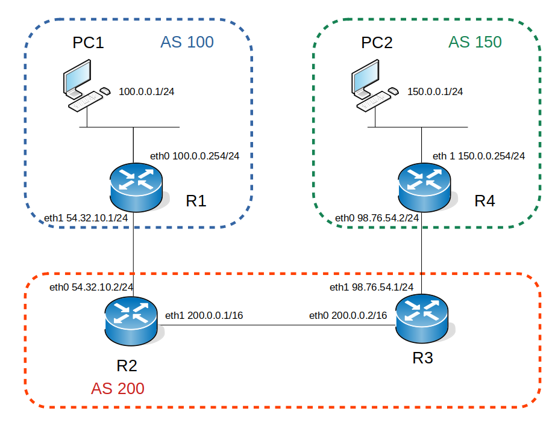

## Premiers pas avec BGP

Avant de commencer le TP et de façon similaire au TP OSPF, nous allons apprendre à configurer BGP sur une topologie très simple comme celle qui vous a été présentée en cours. Cette topologie est disponible [ici](bgp_topo_simple_v2.gnet). Pour la lancer, dans un terminal taper `gonetem-emulator bgp_topo_simple.gnet`.

La configuration IP ayant déjà été effectuée, vous pouvez vous concentrer sur la configuration du routage uniquement. Le schéma de cette topologie vous est présenté ci-dessous :

|  |
| :----------------------------------------: |
|       *Fig. 1 Topologie du réseau.*        |


Comme vous pouvez le voir, trois AS seront interconnectés grâce à BGP.

## eBGP : mise en oeuvre des relations de voisinage

Nous allons tout d'abord réaliser les opérations de voisinage entre les AS. Cela concerne donc les couples de routeurs (R1, R2) et (R3, R4).  Afin d'observer les messages d'échanges BGP, réalisez une capture wireshark sur R1 avec `capture R1.1` qui vous retournera l'intégralité des échanges protocolaires. Retrouvez-vous les messages présentés en cours ?

Notez qu'un `debug bgp updates` a été activé sur R1 et R2. Les logs étant sauvés dans `/var/log/frr/bgpd.log`. Vous pouvez donc également lancer une console de debug depuis l'interface Gonetem sur R1 : `debug R1` et tapez `tail -f  /var/log/frr/bgpd.log | grep BGP` et laissez cette console de debug active durant votre configuration afin d'observer uniquement les échanges BGP.

Configurez BGP sur R1. Il est nécessaire de lancer ces 2 commandes avant la déclaration des voisins sinon ils ne coopèrent pas :
```
R1(config)# router bgp 100
R1(config-router)# no bgp ebgp-requires-policy
R1(config-router)# no bgp network import-check
```
Nous déclarerons R1 et R2 voisins comme suit :
```
R1(config)# router bgp 100
R1(config-router)# neighbor 54.32.10.2 remote-as 200
```
puis sur R2 :
```
R2(config)# router bgp 200
R2(config-router)# neighbor 54.32.10.1 remote-as 100
```
Vous observez sur votre capture les connexions réalisées en R1 et R2 et devriez voir sur votre console de debug le message d'update BGP reçu par R1 comme illustré ci-dessous :
```
root@R1:/# tail -f /var/log/frr/bgpd.log | grep BGP
2020/10/10 09:07:24 BGP: 54.32.10.2 rcvd UPDATE wlen 0 attrlen 0 alen 0
2020/10/10 09:07:24 BGP: bgp_update_receive: rcvd End-of-RIB for IPv4 Unicast from 54.32.10.2 in vrf default
2020/10/10 09:07:24 BGP: u1:s1 announcing routes upon coalesce timer expiry(1100 ms)
```

Vous pouvez vérifier la bonne mise en place des voisins via `show ip bgp summary`, par exemple sur R1 :

```
IPv4 Unicast Summary:
BGP router identifier 100.0.0.254, local AS number 100 vrf-id 0
BGP table version 0
RIB entries 0, using 0 bytes of memory
Peers 1, using 20 KiB of memory

Neighbor        V         AS MsgRcvd MsgSent   TblVer  InQ OutQ  Up/Down State/PfxRcd
54.32.10.2      4        200       5       5        0    0    0 00:02:48            0

Total number of neighbors 1
```
La signification des champs est disponible sur la page de manuel CISCO de [ip bgp summary](https://www.cisco.com/c/en/us/td/docs/ios-xml/ios/iproute_bgp/command/iproute_bgp-xe-3se-3850-cr-book/iproute_bgp-xe-3se-3850-cr-book_chapter_0100.html#wp1583714062). Les champs ont pour signification :

| Champs | Signification |
| ------------ | ---------------------------------------------------------------------------------------------------------------------------- |
| Neighbor | IP address of the neighbor |
| V | BGP version number spoken to the neighbor |
| AS | Autonomous system number |
| MsgRcvd | Number of messages received from the neighbor |
| MsgSent | Number of messages sent to the neighbor |
| TblVer | Last version of the BGP database that was sent to the neighbor |
| InQ | Number of messages queued to be processed from the neighbor |
| OutQ | Number of messages queued to be sent to the neighbor |
| Up/Down | The length of time that the BGP session has been in the Established state, or the current status if not in the Established state |
| State/PfxRcd | Current state of the BGP session, and the number of prefixes that have been received from a neighbor or peer group. When the maximum number (as set by the neighbor maximum-prefix command) is reached, the string “PfxRcd” appears in the entry, the neighbor is shut down, and the connection is set to Idle |


De la même manière que pour OSPF, on utilisera la commande `network` pour annoncer les réseaux de notre AS. 

Dans ce cas pour R1 :

```
R1(config)# router bgp 100
R1(config-router)# network 100.0.0.0/8
```
et pour R2 :
```
R2(config)# router bgp 200
R2(config-router)# network 200.0.0.0/8
```
La réseau 54.32.10.0/24 étant en dehors de chaque AS, celui-ci ne sera pas annoncé. 

Dans la console de debug R1 vous devriez voir apparaître l'ajout de la route suivante :

```
2020/10/10 09:16:39 BGP: u2:s2 send UPDATE 200.0.0.0/16 IPv4 unicast
2020/10/10 09:16:39 BGP: u2:s2 send UPDATE len 51 numpfx 1
2020/10/10 09:16:39 BGP: u2:s2 54.32.10.2 send UPDATE w/ nexthop 54.32.10.2
```
Depuis R1 : 

* `show ip bgp neighbors 54.32.10.2 advertised-routes` vous permet de voir les routes annoncées vers R2;
* `show ip bgp neighbors 54.32.10.2 routes`, les routes reçues par R1 provenant de R2;
* `show ip route` l'ajout des routes dans votre FIB. 

Vérifiez depuis R2 que vous pinguez l'adresse de PC1 (`do ping 100.0.0.1`).

Il ne vous reste plus qu'à répéter ces opérations pour R3 et R4. Toutes ces des relations sont dites eBGP car elles concernent l'interconnexion de deux AS.

## iBGP : mise en oeuvre interne de BGP dans un AS

Nous allons maintenant configurer l'AS 200. Pour cela il ne nous reste plus qu'à établir la relation BGP entre R2 et R3. Comme précédemment, il suffit que R2 déclare R3 comme voisin et vice-versa. Effectuez tout d'abord un `show ip bgp summary` sur R2 puis notez le retour de la commande, ensuite configurez la relation sur chaque routeur de la façon suivante sur R2 :
```
R2(config)# router bgp 200
R2(config-router)# neighbor 200.0.0.2 remote-as 200
```
et sur R3 :
```
R3(config)# router bgp 200
R3(config-router)# neighbor 200.0.0.1 remote-as 200
```
De nouveau un `show ip bgp summary` sur R2 vous donnera :
```
IPv4 Unicast Summary:
BGP router identifier 200.0.0.1, local AS number 200 vrf-id 0
BGP table version 220
RIB entries 7, using 1288 bytes of memory
Peers 2, using 41 KiB of memory

Neighbor        V         AS MsgRcvd MsgSent   TblVer  InQ OutQ  Up/Down State/PfxRcd
54.32.10.1      4        100      12      12        0    0    0 00:06:21        
200.0.0.2       4        200       4       5        0    0    0 00:00:34   

Total number of neighbors 2
```

Cependant, en faisant un `show ip route` sur R1 et R2, vous verrez que la route 150.0.0.0/8 n'est pas connue. Or un `show ip bgp neighbors 200.0.0.1 advertised-route` sur R3 vous indique bien que R3 communique la route à R2 comme montré ci-dessous :
```
BGP table version is 6, local router ID is 200.0.0.2, vrf id 0
Default local pref 100, local AS 200
Status codes:  s suppressed, d damped, h history, * valid, > best, = multipath,
               i internal, r RIB-failure, S Stale, R Removed
Nexthop codes: @NNN nexthop's vrf id, < announce-nh-self
Origin codes:  i - IGP, e - EGP, ? - incomplete

   Network          Next Hop            Metric LocPrf Weight Path
*> 150.0.0.0/8      98.76.54.2               0    100      0 150 i
*> 200.0.0.0/16     0.0.0.0                  0    100  32768 i
```
Pourquoi R2 ne l'ajoute-t-elle pas dans sa FIB ? Pour le savoir faites un `show ip bgp 150.0.0.0/8` vous verrez alors comme indiqué ci dessous que le problème vient de l'inaccessibilité de la passerelle 98.76.54.2.
```
BGP routing table entry for 150.0.0.0/8
Paths: (1 available, no best path)
  Not advertised to any peer
  150
    98.76.54.2 (inaccessible) from 200.0.0.2 (200.0.0.2)
      Origin IGP, metric 0, localpref 100, invalid, internal
      Last update: Mon Oct 12 17:50:37 2020
```
Nous pouvons résoudre le problème en ajoutant une route statique vers le réseau 98.76.54.0/24 sur R2 et respectivement vers le réseau 54.32.10.0/24 sur R3. Afin de comprendre ce qui va se passer : faites un `show ip route` sur R2, ajoutez ensuite la route statique avec `ip route 98.76.54.0/24 200.0.0.2` et faites de nouveau un `show ip route` pour observer les changements. Affichez les routes sur R1 pour vous assurer que le réseau 150.0.0.0/8 est bien diffusé.

Une fois fait, tentez un `ping 150.0.0.1` ou un `traceroute -n 150.0.0.1` depuis PC1 pour vérifier le bon fonctionnement de votre configuration.

## Pour résumer

BGP est un protocole complexe avec de multiples options de configuration. Votre principale tâche est donc de vous assurer que les annonces de routes sont correctement effectuées et que vos voisins sont effectivement joignables. Les principales commandes dont vous avez besoin pour la suite seront :

* `show ip route <bgp|ospf>`
* `show ip bgp summary`
* `show ip bgp neighbors A.B.C.D advertised-routes` 
