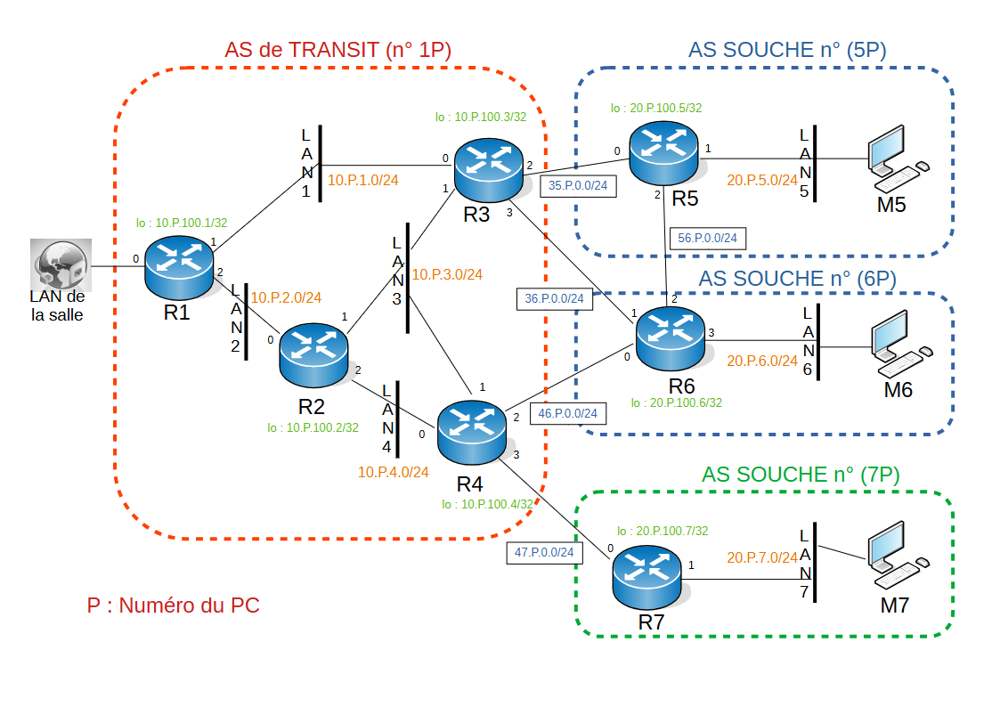
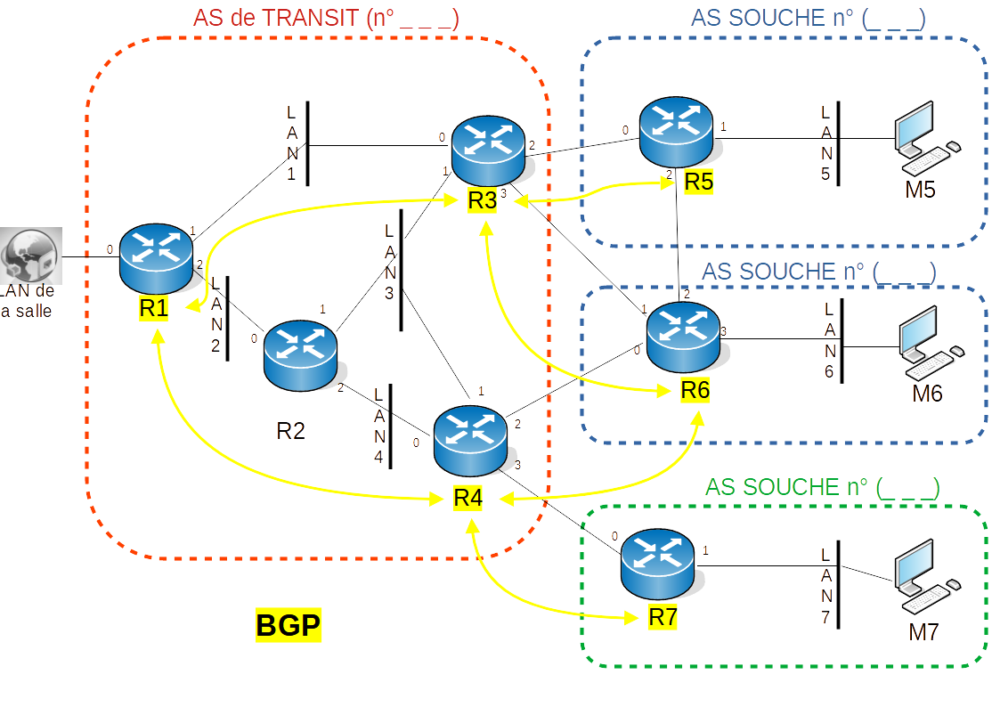
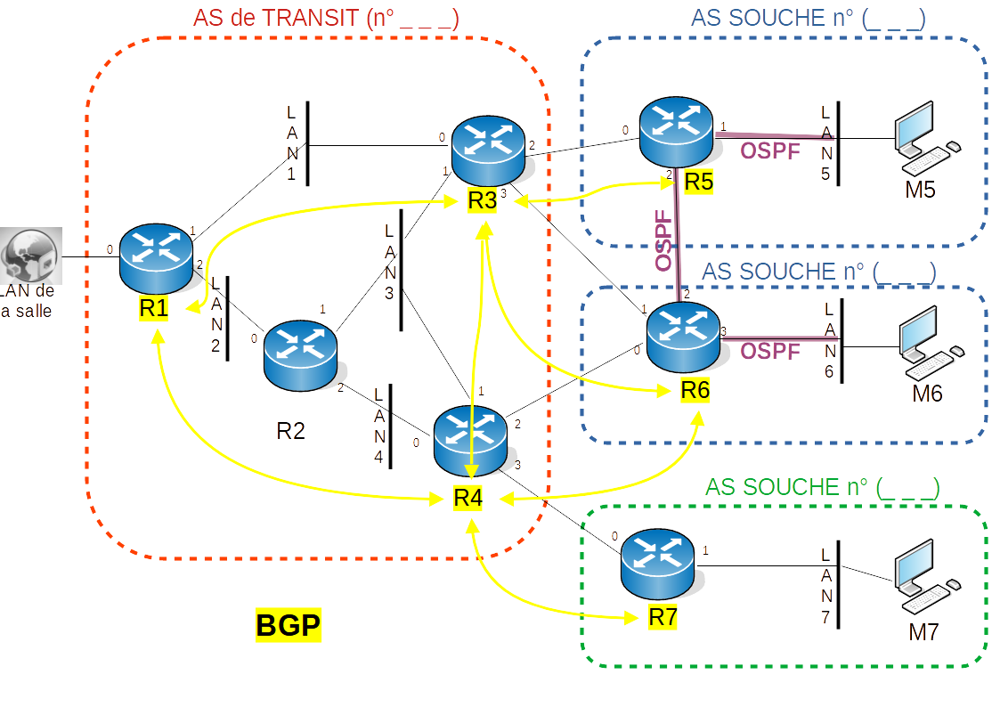

Ce document est sous licence Creative Creative Commons <br>
Attribution - Pas d’Utilisation Commerciale - Partage dans les Mêmes Conditions 3.0 France <br>
Merci de prendre connaissance de vos droits ici : [CC BY-NC-SA 3.0 FR](https://creativecommons.org/licenses/by-nc-sa/3.0/fr/)

## Objectifs du TP
1. Comprendre le fonctionnement de BGP
2. Comprendre une configuration simple de BGP pour un AS de transit
3. Comprendre une configuration simple de BGP pour un AS souche

## Présentation du TP

Ce TP a pour but d'illustrer le fonctionnement de BGP dans un cas simple mais néanmoins réaliste. Par binôme, vous serez en charge d’administrer 4 AS dont une AS de transit qui vous permettra de vous connecter avec les autres binômes partenaires. 

## 1 Topologie

La Topologie de travail est la suivante :

  

| *Fig. 1 Topologie du réseau.* |

Les AS sont délimités par les pointillés. La prise "LAN de la salle" représentée à gauche de la figure symbolise la liaison entre l'AS de transit des binômes partenaires. Dans les faits, cette prise sera reliée à un LAN du réseau réel de la salle et vous permettra de vous interconnecter avec les AS des autres binômes.

 

## 2 Mise en place

### 2.1 Adressage

Des fichiers gonetem préconfigurés avec l'adressage IP sont disponibles. Afin de synchroniser tout le monde et éviter d'avoir plusieurs adressages qui se chevauchent, téléchargez le fichier correspondant au numéro de votre PC : 

* [PC12](gnet/postesBGP/TP_BGP_POSTE12.gnet)
* [PC14](gnet/postesBGP/TP_BGP_POSTE14.gnet)
* [PC16](gnet/postesBGP/TP_BGP_POSTE16.gnet)
* [PC18](gnet/postesBGP/TP_BGP_POSTE18.gnet)
* [PC22](gnet/postesBGP/TP_BGP_POSTE22.gnet)
* [PC24](gnet/postesBGP/TP_BGP_POSTE24.gnet)
* [PC26](gnet/postesBGP/TP_BGP_POSTE26.gnet)
* [PC28](gnet/postesBGP/TP_BGP_POSTE28.gnet)
* [PC32](gnet/postesBGP/TP_BGP_POSTE32.gnet)
* [PC34](gnet/postesBGP/TP_BGP_POSTE34.gnet)
* [PC36](gnet/postesBGP/TP_BGP_POSTE36.gnet)
* [PC38](gnet/postesBGP/TP_BGP_POSTE38.gnet)
* [PC42](gnet/postesBGP/TP_BGP_POSTE42.gnet)
* [PC44](gnet/postesBGP/TP_BGP_POSTE44.gnet)
* [PC52](gnet/postesBGP/TP_BGP_POSTE52.gnet)
* [PC62](gnet/postesBGP/TP_BGP_POSTE62.gnet)

Le plan d'adressage suit la logique suivante :

P = numéro de poste.

* Vous avez pour l'AS de transit un réseau en `10.P.0.0/16` 
    * préfixe `10.P.1.0/24` pour le LAN1, 
    * préfixe `10.P.2.0/24` pour le LAN2 
    * préfixe `10.P.3.0/24` pour le LAN3,
    * préfixe `10.P.4.0/24` pour le LAN4. 
* Pour les AS souches : 
   * `20.P.5.0/24` pour le LAN5 
   * `20.P.6.0/24` pour le LAN6 
   * `20.P.7.0/24` pour le LAN7
* Pour les loopback de l’AS de transit : `10.P.100.’numéro de routeur’/32`
* Pour les loopback des AS souches : `20.P.100.’numéro de routeur’/32`
* Pour les LAN entre AS : 
   * `35.P.0.0/24` entre R3 et R5, 
   * `36.P.0.0/24` entre R3 et R6, 
   * `46.P.0.0/24` entre R4 et R6, 
   * `47.P.0.0/24` entre R4 et R7 
   * `56.P.0.0/24` entre R5 et R6

Toutes les interfaces des routeurs ont pour numéro d'hôte leur numéro de routeur.

Vous utiliserez les numéros d'AS suivants : 

* 1P pour l'AS de transit
* 5P pour l'AS souche avec R5
* 6P avec pour l’AS souche avec R6 
* 7P pour l’AS souche avec R7

<font color=blue><b>Point de vérification </b></font>

### 2.2 Lancement des machines

Dans le cas des routeurs R1 qui seront reliés les uns aux autres via l'interface de bridge sur R1 (i.e. LAN vers la salle), utilisez l'adresse IP suivante `54.32.10.P/24` ou `P` est votre numéro de poste, afin que votre adresse soit unique sur ce réseau.
Sauvegarder vos travaux depuis gonetem.

## 3 Manipulations

Les manipulations se dérouleront en plusieurs parties.
Le but final étant d'avoir une interconnexion entre tous les binômes reliés. 

### 3.1 Configuration de l’AS de transit et des AS souches

Vous pouvez maintenant passer à la configuration de BGP. Les commandes utiles sont :

* `router bgp <numero d’as du routeur local>` permet de passer en mode configuration de BGP;
* `neighbor <adresse ip du voisin> remote-as <numéro d’as du voisin>` permet de déclarer un voisin BGP du routeur, à répéter pour chaque voisin;
* `network <préfixe à annoncer en notation CIDR>` permet de déclarer un réseau via BGP.

N'oubliez pas d'ajouter sur les routeurs : 
```
no bgp ebgp-requires-policy
no bgp network import-check
```
N'hésitez pas à relancer le démon BGP après chaque changement de config par `clear bgp *` ou `do clear bgp *` en mode config.

 


Configurez vos routeurs de façon à ce qu'ils connaissent leurs voisins BGP (surlignage jaune sur le schéma) et qu'ils annoncent leur réseau (le /16 pour l’AS de transit et le /24 pour l’AS souche). Chaque routeur du réseau de transit sera voisin d’un ou plusieurs autres routeurs BGP en respectant le schéma de la TOPOLOGIE.


### 3.2 Vérification de la configuration BGP

Afin de vérifier que la configuration est correcte, vous utiliserez les commandes `show ip route`, `show ip bgp`, `show ip bgp neighbors` et `show ip bgp <préfixe CIDR>`. 


Quels sont les préfixes BGP annoncés par les autres routeurs au routeur R1 ?

<font color=blue><b>Point de vérification </b></font>

Quel(s) routeur(s) ne voit pas l’annonce du LAN4 ? Pourquoi ? Et comment corriger cela ?

<font color=blue><b>Point de vérification </b></font>


### 3.3 Distribution des routes par un IGP + voisinage BGP full mesh 

Vous ajouterez maintenant la relation de voisinage manquante sur BGP (voir dernière topo)
Afin de résoudre les éventuels problèmes de passerelle inaccessible, nous allons déployer le protocole OSPF dans le réseau de transit. Les routeurs utiliseront OSPF pour annoncer les routes directement rattachées sur chacun des réseaux internes.
La configuration d'OSPF dans les routeurs de l'AS de transit se fera en recopiant et modifiant suivant votre topologie les lignes suivantes:

```
 router ospf
 network x.x.x.x/x area 0
 network x.x.x.x/x area 0
```

Vérifiez à nouveau la configuration de BGP sur tous les routeurs. Le problème est il résolu?

<font color=blue><b>Point de vérification</b></font>


### 3.4 Optimisation du routage: BGP Backdoor Routes

  

Configurez OSPF sur les routeurs R4 et R5 de manière à partager leur LAN respectif le long de l'adjacence en violet (voir schéma de la topo).

<font color=blue><b>Point de vérification</b></font>

Lorsque votre routeur découvre un préfixe via (e)BGP et un IGP (RIP, OSPF ou EIGRP), il préférera toujours la route BGP externe. (e)BGP utilise une distance administrative de 20, il est donc préféré à OSPF (110), RIP (120) ou EIGRP (90).
Dans notre cas, R4 et R5 disposent d'un lien «backdoor» rapide et OSPF est configuré pour échanger certains préfixes entre les deux sites. 
R4 et R5 utilisent R3 pour atteindre leur LAN respectif. Cela se produit parce que la distance administrative de (e)BGP est de 20 alors que OSPF a une DA de 110. Par conséquent, OSPF est supprimé de la table de routage. Alors, comment pouvons-nous résoudre ce problème ? Plusieurs possibilités (modifier la distance administrative manuellement par exemple), ici nous utiliserons la fonctionnalité « backdoor», voyons donc comment cela fonctionne.

Sur chaque routeur utilisant la fonctionnalité, (en mode configuration BGP) : 
`network A.B.C.D/M backdoor`.
Le réseau A.C.B.C/M  correspond au réseau distant qui doit être atteint via OSPF. La configuration du routeur R5 est donc :

```
router bgp  
 network 20.P.5.0/24
 network 20.P.6.0/24 backdoor
```

Un fois la porte dérobée configurée, consulter vos tables de relayage. Quelles sont les distances administratives associées au réseau 20.P.6.0/24 sur R5 ?

<font color=blue><b>Point de vérification </b></font>


 

### 3.5 Connexion avec autres binômes et tests

Connectez-vous maintenant avec un ou plusieurs autres binômes pour vérifier votre configuration.
Déclarer votre routeur R1 comme voisin du routeur R1 de l'autre binôme.

Effectuez un ping entre votre machine M4 et les machines M4 et M5 d’un autre binôme.
<font color=blue><b>Point de vérification </b></font>

Effectuez un ping entre votre machine M6 et la machine M4 d’un autre binôme.
<font color=blue><b>Point de vérification </b></font>

### 3.6 Configuration BGP avec filtre sur l’AS du LAN6

Pour la suite, avant de vous connecter avec un autre binôme, vous allez restreindre les informations de routage que votre routeur R1 annonce. Pour cela vous appliquerez un filtre de routage. Plusieurs méthodes existent, ici nous filtrerons sur les préfixes.
Pour cela, vous définirez les voisins BGP sur lesquels vous appliquerez votre filtre avec la commande (dans le mode config de BGP) :

`neighbor A.B.C.D distribute-list 1 out`

Puis vous définirez votre filtre (en mode config) avec les commande :

`access-list 1 deny A.B.C.0/M`

`access-list 1 permit D.E.0.0/N`

Le but étant d’autoriser les annonces de toutes vos AS sauf l’AS verte (du LAN6)

Effectuez un ping entre votre machine M6 et la machine M4 d’un autre binôme.

<font color=blue><b>Point de vérification </b></font>

###ANNEXE Distance Administrative

| Protocole de routage |  Distance administrative |
|-------------------------|---------------------------|
| Directement connecté | 0 |
| Route statique | 1 |
| (e-)BGP | 20 |
| OSPF | 110 |
| IS-IS | 115 |
| RIP | 120 |
| (i-)BGP | 200 |
| Inconnu | 255 |

