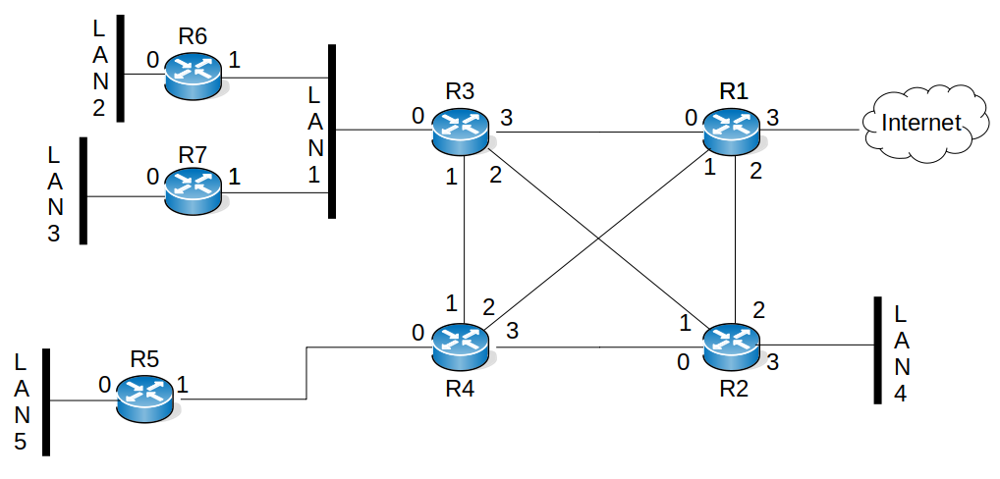

# TP OSPF

## Objectifs du TP

1. Comprendre le fonctionnement de OSPF
1. Savoir utiliser OSPF comme protocole de routage dynamique
1. Savoir réaliser une configuration simple d'OSPF

## Présentation du TP

Ce TP a pour but de vous faire découvrir le protocole de routage dynamique OSPF. L'utilisation d'un tel protocole n'ayant d'intérêt que dans le cas d'un réseau suffisamment complexe, il est nécessaire d'expérimenter ce protocole sur une topologie comprenant un nombre conséquent de routeurs. Dans ce TP, vous prendrez le rôle de l'administrateur réseau d'un (petit) AS. A ce titre, vous devrez décider du plan d'adressage de votre AS (en accord avec les adresses qui vous seront attribuées) et de la configuration des routeurs. De plus, pour tester la fonctionnalité du système, vous pourrez être amenés à configurer les adresses et les routes sur les machines hôtes de test.

Ce TP sera réalisé avec Pynetem. Avant de rentrer dans la configuration d'une topologie complexe, nous débuterons celui-ci en configurant un petit réseau composé de deux routeurs. Notez que l'ensemble des commandes nécessaires à ce TP vous sont récapitulées en annexe.

## Premiers pas avec OSPF

Avant de commencer le TP nous allons apprendre à configurer OSPF sur une topologie très simple composée de deux routeurs interconnectant deux hôtes. Cette topologie est disponible [ici](topo_simple.pnet). Pour la lancer, dans un terminal taper `pynetem-emulator topo_simple.pnet`.

**Première étape - adressage**

Configurons cette topologie avec l'adressage suivant :

```bash
       192.168.1.0/24       10.0.0.0/8        192.168.2.0/24
 PC1 ------------------ R1 ------------ R2 ------------------ PC2
   .1               .254 .1           .2 .254                .1
   
```

Par exemple, les commandes à utiliser sur PC1 sont :
```bash
root@PC1:/# ip addr add 192.168.1.1/24
root@PC1:/# ip route add default via 192.168.1.254
```
et les commandes sur R1 sont :
```bash
R1# enable
R1# config terminal
R1(config)# interface eth0
R1(config-if)# no shutdown
R1(config-if)# ip add 192.168.1.254/24
R1(config-if)# interface eth1
R1(config-if)# no shutdown
R1(config-if)# ip add 10.0.0.1/8
```
Faire de même sur PC2 et R2 en utilisant l'adressage du plan d'adressage ci-dessus.

**Deuxième étape - mise en place du routage**

Une fois l'adressage réalisé, vous noterez que les tables de routage de R1 et R2 ne sont pas complètes. Vous pouvez le vérifier en tapant sur chaque routeur `show ip route`.

<font color=blue>**Question A** - quelle route manque-t-il sur chaque routeur pour que les deux PC puissent se joindre ?</font>

Ces routes manquantes seront instanciées par le protocole OSPF que vous allez déployer sur ces mêmes routeurs. Pour cela, réaliser les opérations ci-dessous. Tout d'abord pour rentrer en mode configuration OSPF :
```bash
R1(config)# router ospf
```
Si vous ajoutez un `?` à la fin de cette commande, vous verrez qu'elle prend notamment en argument une valeur d'instance (`Instance ID`) optionnelle. Nous omettrons cette valeur qui est un identifiant de processus OSPF local permettant l'exécution de plusieurs processus OSPF sur le même routeur. Cette opération n'est pas recommandée car elle crée plusieurs instances qui ajoutent une surcharge supplémentaire au routeur [[CISCO OSPF]](https://www.cisco.com/c/fr_ca/support/docs/ip/open-shortest-path-first-ospf/7039-1.html). L'autre option notée `vrf` (*virtual routing and forwarding*) est une fonctionnalité permettant à plusieurs instances d'une table de routage de coexister sur le même routeur en même temps. C'est un peu comme faire du VLAN mais au niveau IP [[CISCO VRF]](https://www.cisco.com/c/en/us/td/docs/routers/connectedgrid/cgr1000/ios/software/15_4_1_cg/vrf_cgr1000.html), cette fonctionnalité sort du cadre de ce TP et ne sera pas abordée.

Une fois cette commande saisie, un processus OSPF est lancé sur le routeur mais aucune annonce n'est encore effectuée. En effet, il faut spécifiquement déclarer les interfaces qui vont entrer en jeu. Pour cela, nous allons utiliser la commande `network` qui prendra en argument l'adresse du réseau et son aire (cf. cours). (Notez que sur CISCO la notation diffère un peu et que le *wildcard mask* (inverse du *netmask*) est utilisé en lieu et place de la notation CIDR `A.B.C.D/M`). Pour les interfaces du router R1 cela donne :
```bash
R1(config-router)# network 192.168.1.0/24 area 0
R1(config-router)# network 10.0.0.0/8 area 0
```
Il est également possible de définir un identifiant de routeur via la commande `router-id A.B.C.D`. Si non spécifiée, l'ID de routeur est l’adresse IP la plus élevée ou, si configurée, la plus élevée des adresses de *loopback*. Bien qu'il ne soit pas nécessaire de spécifier un router ID, le choisir explicitement aidera au déboguage, par exemple lors d'un `show ip ospf neighbor`.

Ici, nous déclarerons chaque routeur dans une seule aire, la zéro. Réaliser maintenant les opérations similaires sur R2 puis effectuer un `ip ospf route` pour vérifier la bonne déclaration des routes dans chaque table. Notez les informations qui y sont listées, notamment la valeur entre crochets qui correspond à une métrique de distance. Le drapeau `N` signifie que ce sont des routes de réseaux.

<font color=blue>**Question B** - comment expliqueriez-vous la valeur de métrique choisie ?</font>

Il est possible de changer cette valeur avec `ip ospf cost <val>` sur l'interface concernée. Cette valeur sera utilisé par l'algorithme SPF (*Shortest Path First*) pour recalculer le graphe en fonction.

Il est également possible de consulter les routes via `show ip route` qui retourne alors toute la table d'acheminement (FIB). Nous obtenons via cette commande deux valeurs entre crochets. La seconde est celle de la métrique également retournée par `ip ospf route` tandis que la première est une distance administrative (*Administrative Distance : AD*) ou route de préférence. C'est une valeur arbitraire permettant de classer les routes obtenues (par divers protocoles de routage) où une faible valeur indique une route préférée. Chaque constructeur utilise ses propres valeurs avec 110 pour OSPF (comme vous pouvez le voir), 120 pour RIP, 20 pour BGP, ... Consultez la page [CISCO show_ip_route](https://www.cisco.com/E-Learning/bulk/public/tac/cim/cib/using_cisco_ios_software/cmdrefs/show_ip_route.htm) pour plus de détails.

Il est préférable de ne pas diffuser les annonces OSPF sur les réseaux d'extrémités (i.e. vers PC1 et PC2). L'option `passive-interface <interface>` permet de rendre muette une interface, ainsi le réseau attaché sera toujours annoncé mais l’interface n’émettra pas de paquets OSPF. Par exemple sur R1 :
```
R1(config-router)# passive-interface eth0
```
pour stopper les annonces OSPF vers PC1. Notez que la commande `show ip ospf interface eth0` vous permettra de vérifier la mise en oeuvre de cette option :
```
R1# show ip ospf interface eth0
eth0 is up
  ifindex 19, MTU 1500 bytes, BW 1000000 Kbit <UP,BROADCAST,RUNNING,MULTICAST>
  OSPF not enabled on this interface
  (...)
```

**Troisième étape - vérification du bon fonctionnement**

Nous allons lister dans cette troisième et dernière partie les commandes importantes qui vous permettrons de vérifier le bon fonctionnement du routage OSPF.

La commande `show ip ospf neighbor` retourne des informations sur les routeurs voisins. Regardons les informations qu'elle nous permet d'obtenir, par exemple, sur R1:

```
R1# show ip ospf neighbor

Neighbor ID        Pri State          Dead Time  Address      Interface        (...)
192.168.2.254       1 Full/DR          32.067s   10.0.0.2     eth1:10.0.0.1    (...)
```

`Neighbor ID` est l'ID de routeur du routeur voisin. L'ID de routeur est l'adresse IP la plus élevée ou, si configurée, la plus élevée des adresses de *loopback*. Cette dernière peut-être configurée manuellement avec `router-id a.b.c.d`. Puisque R1 n'a pas d'adresse de *loopback* de configurée l'adresse IP la plus haute devient l'ID de routeur. 

`Priority` le champ `Pri` indique la priorité du routeur voisin. Le routeur avec la valeur la plus petite est le plus prioritaire et devient le maître (*Designated Router - DR*). Si les priorités sont identiques, alors le routeur avec l'ID du routeur le plus élevé devient le DR (mais parfois c'est le premier routeur lancé qui le devient). Par défaut, des priorités sont fixées à 1. Vous pouvez vérifier que R2 est bien en *backup*.

`State` ce champ indique l'état fonctionnel du routeur voisin. Voir [CISCO OSPF Neighbor States](https://www.cisco.com/c/en/us/support/docs/ip/open-shortest-path-first-ospf/13685-13.html). Dans l'exemple ci-dessus, cela signifie que R1 est routeur élu (DR) et qu'il est adjacent (Full).

`Dead Time` indique la durée d'attente de réception d'un paquet HELLO OSPF du voisin avant de le déclarer "mort". Cette valeur est de 40s par défaut sur les réseaux point à point et de 120s sur les réseaux multipoints et à non-diffusion. Donc R1 considérera R2 "mort" si il n'obtient pas de réponse après 32s.

`Address` adresse IP de connexion directe avec le voisin.

`Interface` interface du routeur (et IP) vers lequel la connection est réalisée.

Les quatre autres commandes qui vous seront utiles pour vérifier le bon fonctionnement de votre configuration sont :

* `show ip ospf database` qui vous donne le contenu de la RIB d'OSPF;
* `show ip ospf interface <iface>` qui vous donne des information la configuration OSPF de l'interface;
* `show ip ospf route ` qui vous donne le contenu de la FIB issue d'OSPF;
* `show ip route` qui vous donne le contenu de la table d'acheminement (FIB).

Ces deux dernières commandes ayant été déjà été abordées ci-dessus en seconde partie.

**Quatrième étape - ajout d'une passerelle externe**

Nous allons ajouter une passerelle externe sur R1. Cette passerelle permettra la connexion vers d'autres AS. <font color=red><b>Prob. de connexion du bridge</b></font>
Nous utiliserons pour cela les deux nouvelles commandes suivantes :

* `default-information originate` qui indique à OSPF d'accepter de diffuser une route par défaut (ce qu'OSPF ne fait pas normalement);
* `redistribute static` qui indique de redistribuer dans OSPF toutes les routes statiques (ici, il n'y en a qu'une).
Tout d'abord configurons l'interface `eth2` :
```
R1(config)# interface eth2
R1(config-if)# ip address 172.16.1.1/16
```
puis la route par défaut :
```
R1(config)# ip route 0.0.0.0/0 172.16.1.254
```
La configuration OSPF de R1 devient :
```
!
router ospf
 redistribute static
 passive-interface eth0
 network 10.0.0.0/8 area 0
 network 192.168.1.0/24 area 0
 default-information originate
!
```
Sur le routeur R2 (qui n'a pas changé de configuration), on peut voir désormais la route par défaut :

```
 R2# show ip ospf route 
 ============ OSPF network routing table ============
 N    10.0.0.0/8         [10] area: 0.0.0.0
			 directly attached to eth0
 N    192.168.1.0/24     [210] area: 0.0.0.0
                         via 10.0.0.1, eth0
 N    192.168.2.0/24     [10] area: 0.0.0.0
		         directly attached to eth1

 ============ OSPF router routing table =============
 R    192.168.1.254      [10] area: (0.0.0.0), ASBR
                         via 10.0.0.1, eth0

 ============ OSPF external routing table ===========
 N E2 0.0.0.0/0          [10/10] tag: 0
                         via 10.0.0.1, eth0
```
 
R1 est désormais marqué comme ASBR (Autonomous System Boundary Router) car il est situé aux limites de l'AS puisqu'il injecte une route externe, qui apparait comme de type E2 (Externe 2). Une route externe est soir qualifiée E1 ou E2 en fonction de sa métrique. La E1 est toujours préférée. Le coût des routes E2 est toujours la métrique externe, la métrique ne tiendra pas compte du coût interne pour atteindre ce réseau. Tandis que le coût des routes E1 est le coût de la métrique externe avec l'ajout du coût interne dans OSPF pour atteindre ce réseau (le coût de l'ASBR + le coût externe).

Pour mémoire, vous voyez le coût de chaque route entre crochets. OSPF permet d'affecter un coût à chaque interface, pour décourager l'utilisation de liens lents, qui ne sont bons qu'à servir de secours. Notre routeur a mis un coût de 10 par défaut. Sur R1 la configuration de l'interface eth0 est la suivante :

```
 ip address 192.168.1.254/24
 ip ospf cost 200
```
C'est pourquoi sur R2 192.168.1.0/24 a un coût cumulé de 10+200 = 210.

## Manipulations

Suite à cette première partie d'introduction, je vous propose de mettre en oeuvre une topologie plus complexe sur une aire unique.

### Topologie

La topologie du réseau utilisé dans ce TP est décrite par la Fig. 1. N'hésitez pas à utiliser cette image pour votre rapport.


|   |
|:--:|
| *Fig. 1 Topologie du réseau.* |

### Plan d’adressage

La première étape de ce TP consistera en la définition du plan d’adressage du réseau. Vous prendrez soin d'utiliser aussi peu d'adresses que possible tout en tenant compte des contraintes suivantes :

* les LAN 1 à 5 doivent pouvoir accueillir jusqu'à 254 machines;
* le réseau N1 est un réseau NBMA avec au maximum 254 machines;
* les liaisons point-à-point ne doivent pas avoir plus de 2 routeurs.

N'hésitez pas à vous aider d'un calculateur d'adresses IP comme par exemple [http://www.subnet-calculator.com/cidr.php](CIDR calculator).
Puisque tous les AS de la salle seront interconnectés, il est indispensable de s'assurer que leurs adressages seront distincts. Les enseignants feront donc office d'autorité de distribution d'adresses, adressez-vous à eux pour récupérer votre préfixe. Notez que l'adresse externe du routeur R1 vous sera donnée en même temps que le préfixe d'adresse à utiliser pour votre AS.

<font color=blue>**Question 1** - Dessinez la topologie de votre AS et son plan d'adressage.</font>

### OSPF avec aire unique

#### Prise en main d’OSPF

Pour prendre en main le protocole OSPF, vous commencerez par configurer la liaison R1-R3. N'oubliez pas de tester la connectivité entre R1 et R3 avec un `ping`. Puis configurez OSPF entre ces deux routeurs. Vous ajouterez des routes à votre routeur R1 de façon à ce qu'il puisse atteindre les autres AS (une route par AS distant). Pensez ensuite à redistribuer les routes externes à l'AS depuis le routeur R1 et à configurer la liaison comme une liaison "point-to-point" (ce qui vous obligera à déclarer R1 et R3 comme voisins via la commande `neighbor`).
Une fois les deux routeurs configurés, vérifiez le bon fonctionnement d'OSPF avec `show ip ospf database` (R3 doit pouvoir atteindre les autres AS et R1 doit pouvoir atteindre une machine du LAN1). Une fois fait, savegarder la configuration en faisant un `save` dans l'interface de l'émulateur Pynetem.

#### Observation des mécanismes OSPF

Lancez une capture sur l'un des routeurs via Pynetem et la commande `capture R1.1`. 

<font color=blue>**Question 2** - Quels paquets capturez-vous et à quelle fréquence ?</font>

Faites un `shutdown` puis juste après un `no shutdown` depuis l'interface connectée à R3 tout en poursuivant la capture.

<font color=blue>**Question 3** - Quels sont les échanges réalisés entre vos deux routeurs ?</font>

<font color=blue>**Question 4** - Au moyen de la commande `show ip ospf database` dessinez le graphe valué à partir duquel OSPF calcule les routes.</font>

Le lancement d'une capture peut être consommateur en ressource surtout lorsque vous travaillerez sur la topologie complexe. Aussi, il est possible de capturer les messages OSPF de la façon suivante :
```
R1# conf t
R1(config)# debug ospf packet all
R1(config)# log file /var/log/frr/ospfd.log
R1(config)# exit
```
Faites ensuite un :
```
R1# show debugging

OSPF debugging status:
  OSPF packet Hello debugging is on
  OSPF packet Database Description debugging is on
  OSPF packet Link State Request debugging is on
  OSPF packet Link State Update debugging is on
  OSPF packet Link State Acknowledgment debugging is on
```
afin que celui-ci soit bien activé. Enfin n'oubliez pas de faire un `save` dans la console Pynetem si vous souhaitez conserver cette configuration. Il vous suffit de lancer un `debug R1` depuis la console Pynetem et de consulter le fichier de log via, par exemple, `tail -f /var/log/frr/ospfd.log`.

#### Configuration sur tous les routeurs

Configurez tous les routeurs OSPF et LAN restant. Pensez à désactiver l'émission de message OSPF sur les réseaux terminaux (LAN 2 à 5) et à configurer le type de réseau OSPF sur chaque interface. Les interfaces sur N1 seront configurées en mode NBMA ce qui vous obligera à déclarer R4 et R5 comme voisins via la commande `neighbor`. Vérifiez le fonctionnement, puis sauvegardez les configuration des routeurs (`save` dans Pynetem).

Relancez les démons de routage FRR sur les routeurs R3, R6 et R7 en vous connectant via l'interface Pynetem sur la console de debug (par exemple `debug R3`). Depuis la console de debug faire `service frr restart`. Préparez une capture sur l’un de ces routeurs puis lancez un à un les daemons OSPF en observant un temps de pause entre chaque.

<font color=blue>**Question 5** - Dans les échanges entre vos routeurs, relevez et commentez l’élection du routeur désigné (DR) et du routeur désigné de secours (BDR).</font>

<font color=blue>**Question 6** - Avec les commandes `show ip ospf database [...]` regardez la RIB d'OSPF et indiquez l’origine des LSA observés.</font>

Validez le routage par destraceroutevers plusieurs réseaux (dans et hors de votre AS).

#### Re-configuration sur perte de lien

Nous allons maintenant observer le comportement d’OSPF en cas de perte de lien. Nous travaillerons sur le lien R1-R3. Préparez plusieurs captures à des endroits choisis du réseau afin de voir ce qu’il se passe lors de la perte du lien. Validez le nouveau routage par des `traceroute` vers plusieurs réseaux (dans et hors de votre AS).

<font color=blue>**Question 7** - Expliquez les échanges entre les routeurs (choisissez des messages pertinants).</font>

## Annexe : OSPF sur les routeurs FRR

La configuration d’un routeur quagga est très similaire à la configuration d'un routeur Cisco. Vous disposez notamment de l'auto-complétion des commandes et d'une aide en ligne via la touche `?`. Une différence notable avec les routeurs Cisco est le terminal de configuration du routeur est dès le début en mode `enable`.
Les sections suivantes présentent les différentes commandes regroupées par menu.

#### Commandes du menu racine

Vous disposez dans le menu racine (le menu dans lequel vous êtes au démarrage) des mêmes commandes `show` que sur les routeurs Cisco.
Pou sauvegarder la configuration actuelle de votre routeur, n'oubliez pas de faire un `save` dans l'émulateur Pynetem.

Pour rappel, les commandes les plus utiles pour ce TP sont :

* `show ip ospf database` qui vous donne le contenu de la RIB d'OSPF;
* `show ip ospf route` qui vous donne le contenu de la FIB issue d'OSPF;
* `show ip ospf neighbor` qui vous donne des informations sur les voisins OSPF;
* `show ip ospf interface <iface>` qui vous donne des informations la configuration OSPF de l'interface;
* `show ip route` qui vous donne le contenu de la table d’acheminement (FIB).

#### Commandes du menu `configure terminal`

La seule de ce menu que vous aurez à utiliser pour ce TP est `router-id` qui permet de définir l'identifiant du routeur pour tous les protocoles de routage.  D'autre part, les sections suivantes décrivent les commandes des sous-menus de `configure terminal`.

#### Commandes du menu `router ospf`

Ce menu est un sous-menu du menu `configure terminal`.

* `neighbor <neighbor_address>` permet de déclarer un routeur OSPF voisin sur une liaison non broadcast. Attention à bien utiliser l'adresse du voisin correspondant à l'interface du lien considéré et pas son identifiant de routeur;
* `network <net_address> area <area_id>` permet d'activer le routage OSPF sur ce réseau en le liant à l'aire donnée;
* `passive-interface <nom_iface>` permet de rendre muette une interface (le réseau attaché peut être annoncé mais l'interface n'émettra pas de paquets OSPF);
* `redistribute connected` indique à OSPF de redistribuer les routes directes (directly connected) de ce routeur;
* `redistribute kernel` indique à OSPF de redistribuer les routes configurées par l'administrateur dans le noyau;
* `redistribute static` indique à OSPF de redistribuer les routes configurées statiquement;
* `area <area_id> <area_type>` permet de configurer le type d'aire OSPF (p.e. : aire terminale).

Commandes du menu `interface <iface>`

Ce menu est un sous menu du menu `configure terminal`.

* `ip ospf network <net_type>` permet de définir le type de réseau OSPF (broadcast, NBMA, point-to-point ou point-to-multipoint);
* `ip ospf cost <cost>` permet de définir le coût administratif associé à cette interface.


