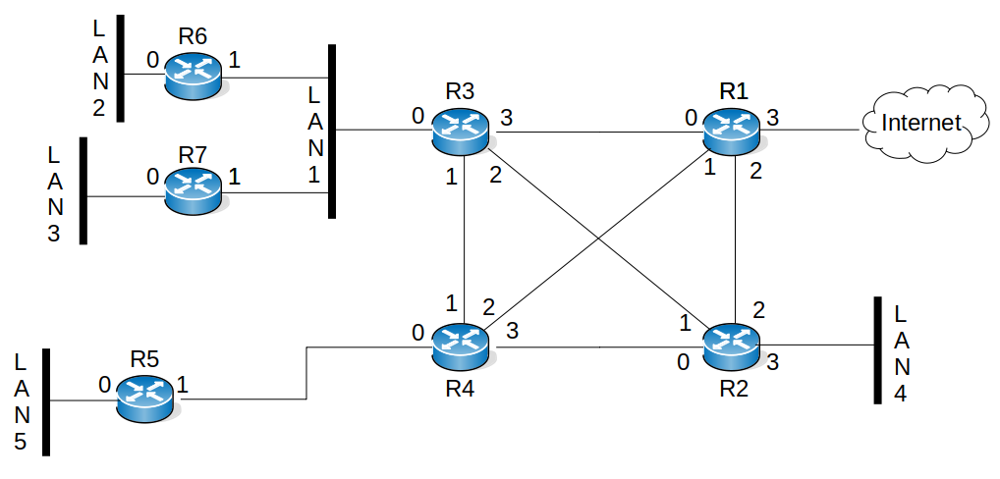

Ce document est sous licence Creative Creative Commons <br>
Attribution - Pas d’Utilisation Commerciale - Partage dans les Mêmes Conditions 3.0 France <br>
Merci de prendre connaissance de vos droits ici : [CC BY-NC-SA 3.0 FR](https://creativecommons.org/licenses/by-nc-sa/3.0/fr/)

# TP OSPF

## Objectifs du TP

1. Comprendre le fonctionnement de OSPF
1. Savoir utiliser OSPF comme protocole de routage dynamique
1. Savoir réaliser une configuration simple d'OSPF

## Présentation du TP

## Objectifs du TP

1. Comprendre le fonctionnement de OSPF
1. Savoir utiliser OSPF comme protocole de routage dynamique
1. Savoir réaliser une configuration simple d'OSPF

## Présentation du TP

Ce TP a pour but de vous faire découvrir le protocole de routage dynamique OSPF. L'utilisation d'un tel protocole n'ayant d'intérêt que dans le cas d'un réseau suffisamment complexe, il est nécessaire d'expérimenter ce protocole sur une topologie comprenant un nombre conséquent de routeurs. Dans ce TP, vous prendrez le rôle de l'administrateur réseau d'un (petit) AS. A ce titre, vous devrez décider du plan d'adressage de votre AS (en accord avec les adresses qui vous seront attribuées) et de la configuration des routeurs. De plus, pour tester la fonctionnalité du système, vous pourrez être amenés à configurer les adresses et les routes sur les machines hôtes de test.

Ce TP sera réalisé avec Gonetem. Avant de rentrer dans la configuration d'une topologie complexe, nous débuterons celui-ci en configurant un petit réseau composé de deux routeurs. Notez que l'ensemble des commandes nécessaires à ce TP vous sont récapitulées en annexe.

## Premiers pas avec OSPF

Avant de commencer le TP nous allons apprendre à configurer OSPF sur une topologie très simple composée de deux routeurs interconnectant deux hôtes. 

**Première étape - découverte de la topologie utilisée**

La topologie utilisée pour la première partie de ce TP est disponible [ici](gnet/topo_simple.gnet). Pour la lancer, dans un terminal taper `gonetem-console open topo_simple.gnet`.

Celle-ci est déjà préconfigurée avec l'adressage suivant :

```bash
       192.168.1.0/24       10.0.0.0/8        192.168.2.0/24
 PC1 ------------------ R1 ------------ R2 ------------------ PC2
 eth0                eth0 eth1       eth0 eth1                eth0      
  .1                 .254 .1          .2 .254                 .1
   
```
Les routes par défaut sont également instanciées. Vérifiez-le avec la commande `ip r` sur PC1 et PC2. 

**Deuxième étape - mise en place du routage**

Une fois l'adressage réalisé, vous noterez que les tables de routage de R1 et R2 ne sont pas complètes. Vous pouvez le vérifier en tapant sur chaque routeur `show ip route`.

<font color=blue>**Question A** - quelle route manque-t-il sur chaque routeur pour que les deux PC puissent se joindre ?</font>

Ces routes manquantes seront instanciées par le protocole OSPF que vous allez déployer sur ces mêmes routeurs. Pour cela, réaliser les opérations ci-dessous. Tout d'abord, nous allons configurer une adresse de loopback sur les routeurs R1 et R2. Cette adresse de loopback permettra notamment d'améliorer la lecture de la commande `ip ospf database` que nous verrons par la suite. Nous utiliserons `192.168.100.1/32` pour R1 et `192.168.100.2/32` pour R2. Cette adresse de loopback deviendra le *router ID* de chaque routeur. Dans le cas où celle-ci ne serait pas prise en compte, faire un `save` pour ne pas perdre votre configuration puis redémarrer le routeur avec la commande `restart` depuis la console Gonetem. Par exemple sur R1, la mise en place d'une adresse de loopback se fait comme suit :

```bash
R1(config)# int lo
R1(config-if)# ip address 192.168.100.1/32
```
L'identifiant du routeur (le *router ID*) est l’adresse IP la plus élevée ou, si configurée, la plus élevée des adresses de *loopback*. Cet identifiant est utile pour mieux identifier les routeurs au déboguage, par exemple, lors d'un `show ip ospf neighbor`. Pour éviter tout problème et bien utiliser l'adresse de *loopback*, en mode configuration OSPF pour R1, saisir :
```bash
R1(config)# router ospf
R1(config-router)# ospf router-id 192.168.100.1
```
Une fois cette commande saisie, un processus OSPF est lancé sur le routeur mais aucune annonce n'est encore effectuée. En effet, il faut spécifiquement déclarer les interfaces qui vont entrer en jeu. Pour cela, il faut déclarer chacune des interfaces qui participeront au processus OSPF de la façon suivante, par exemple pour l'interface eth0 du router R1 cela donne :

```bash
R1(config)# int eth0
R1(config-if)# ip ospf area 0
```
Faire de même avec eth1 et bien évidemment avec lo car l'adresse de *loopback* participe au processus OSPF. Ici, nous déclarerons chaque routeur dans une seule aire : la zéro. Réaliser maintenant les opérations similaires sur R2 puis effectuer un `show ip ospf route` pour vérifier la bonne déclaration des routes dans chaque table. Notez les informations qui y sont listées, notamment la valeur entre crochets qui correspond à une métrique de distance. Le drapeau `N` signifie que ce sont des routes de réseaux (*Network*).

<font color=blue>**Question B** - comment expliqueriez-vous la valeur de métrique choisie ?</font>

Il est possible de changer cette valeur de métrique avec `ip ospf cost <val>` sur l'interface concernée. Cette valeur sera utilisé par l'algorithme SPF (*Shortest Path First*) pour recalculer le graphe en fonction.

Il est également possible de consulter les routes via `show ip route` qui retourne alors toute la table d'acheminement (FIB). Nous obtenons via cette commande deux valeurs entre crochets. La seconde est celle de la métrique également retournée par `show ip ospf route` tandis que la première est une distance administrative (*Administrative Distance : AD*) ou route de préférence. C'est une valeur arbitraire permettant de classer les routes obtenues (par divers protocoles de routage) où une faible valeur indique une route préférée. Chaque constructeur utilise ses propres valeurs avec 110 pour OSPF (comme vous pouvez le voir), 120 pour RIP, 20 pour BGP, ... Consultez la page [CISCO show_ip_route](https://www.cisco.com/E-Learning/bulk/public/tac/cim/cib/using_cisco_ios_software/cmdrefs/show_ip_route.htm) pour plus de détails.

Il est préférable de ne pas diffuser les annonces OSPF sur les réseaux d'extrémités (i.e. vers PC1 et PC2). L'option `ip ospf passive` permet de rendre muette une interface, ainsi le réseau attaché sera toujours annoncé mais l’interface n’émettra pas de paquets OSPF. 

Par exemple la commande suivante sur R1 :

```bash
R1(config-router)# interface eth0
R1(config-if) # ip ospf passive
```
permet de stopper les annonces OSPF vers PC1. Notez que la commande `show ip ospf interface eth0` vous permettra de vérifier la mise en oeuvre de cette option :
```bash
R1# show ip ospf interface eth0
 (...)
 Timer intervals configured, Hello 10s, Dead 40s, Wait 40s, Retransmit 5
    No Hellos (Passive interface)
  Neighbor Count is 0, Adjacent neighbor count is 0
 (...)
```

**Troisième étape - vérification du bon fonctionnement**

Nous allons lister dans cette troisième et dernière partie les commandes importantes qui vous permettrons de vérifier le bon fonctionnement du routage OSPF.

La commande `show ip ospf neighbor` retourne des informations sur les routeurs voisins. Regardons les informations qu'elle nous permet d'obtenir, par exemple, sur R1:

```bash
R1# show ip ospf neighbor

Neighbor ID        Pri State          Dead Time  Address      Interface        (...)
192.168.2.254       1 Full/DR          32.067s   10.0.0.2     eth1:10.0.0.1    (...)
```

`Neighbor ID` est l'ID de routeur du routeur voisin. L'ID de routeur est l'adresse IP la plus élevée ou, si configurée, la plus élevée des adresses de *loopback*. Puisque R1 n'a pas d'adresse de *loopback* de configurée l'adresse IP la plus haute devient l'ID de routeur.

`Priority` le champ `Pri` indique la priorité du routeur voisin. Le routeur avec la valeur la plus petite est le plus prioritaire et devient le maître (*Designated Router - DR*). Si les priorités sont identiques, alors le routeur avec l'ID du routeur le plus élevé devient le DR (mais parfois c'est le premier routeur lancé qui le devient). Par défaut, des priorités sont fixées à 1. Vous pouvez vérifier que R2 est bien en *backup*.

`State` ce champ indique l'état fonctionnel du routeur voisin. Voir [CISCO OSPF Neighbor States](https://www.cisco.com/c/en/us/support/docs/ip/open-shortest-path-first-ospf/13685-13.html). Dans l'exemple ci-dessus, cela signifie que R2 est routeur élu (DR) et qu'il est adjacent (Full).

`Dead Time` indique la durée d'attente de réception d'un paquet HELLO OSPF du voisin avant de le déclarer "mort". Cette valeur est de 40s par défaut sur les réseaux point à point et de 120s sur les réseaux multipoints et à non-diffusion. Donc R1 considérera R2 "mort" si il n'obtient pas de réponse après 32s.

`Address` adresse IP de connexion directe avec le voisin.

`Interface` interface du routeur (et IP) vers lequel la connection est réalisée.

Les quatre autres commandes qui vous seront utiles pour vérifier le bon fonctionnement de votre configuration sont :

* `show ip ospf database` qui vous donne le contenu de la RIB d'OSPF;
* `show ip ospf interface <iface>` qui vous donne des information la configuration OSPF de l'interface;
* `show ip ospf route ` qui vous donne le contenu de la FIB issue d'OSPF;
* `show ip route` qui vous donne le contenu de la table d'acheminement (FIB).

Ces deux dernières commandes ayant été déjà été abordées ci-dessus en seconde partie.

**Quatrième étape - ajout d'une passerelle externe**

Nous allons ajouter une passerelle externe sur R1 qui sera connectée sur la 3ème interface du router (`eth2`). Cette passerelle permettra la connexion vers d'autres AS.
Nous utiliserons pour cela la commande suivante : `default-information originate` qui indique à OSPF d'accepter de diffuser une route par défaut (ce qu'OSPF ne fait pas normalement). Notez qu'il existe également `redistribute static` qui indique de redistribuer dans OSPF toutes les routes statiques. Normalement, seul `default-information originate` suffit pour redistribuer une route par défaut qui est par définition statique. Cependant, la commande de redistribution statique des routes est utile lorsque vous souhaitez une route statique vers un réseau (et pas uniquement une route par défaut).

Tout d'abord configurons l'interface `eth2` :

```bash
R1(config)# interface eth2
R1(config-if)# ip address 172.16.1.1/16
```

puis la route par défaut :

```bash
R1(config)# ip route 0.0.0.0/0 172.16.1.254
```
La configuration OSPF de R1 devient :
```bash
!
router ospf
 ospf router-id 1.1.1.1
 default-information originate
!
```
Sur le routeur R2 (qui n'a pas changé de configuration), on peut voir désormais la route par défaut :

```bash
 R2# show ip ospf route 
 ============ OSPF network routing table ============
 N    10.0.0.0/8         [10] area: 0.0.0.0
			 directly attached to eth0
 N    192.168.1.0/24     [210] area: 0.0.0.0
                         via 10.0.0.1, eth0
 N    192.168.2.0/24     [10] area: 0.0.0.0
		         directly attached to eth1

 ============ OSPF router routing table =============
 R    192.168.1.254      [10] area: (0.0.0.0), ASBR
                         via 10.0.0.1, eth0

 ============ OSPF external routing table ===========
 N E2 0.0.0.0/0          [10/10] tag: 0
                         via 10.0.0.1, eth0
```

R1 est désormais marqué comme ASBR (Autonomous System Boundary Router) car il est situé aux limites de l'AS puisqu'il injecte une route externe, qui apparait comme de type E2 (Externe 2). Une route externe est soit qualifiée E1 ou E2 en fonction de sa métrique. La E1 est toujours préférée. Le coût des routes E2 est toujours la métrique externe, la métrique ne tiendra pas compte du coût interne pour atteindre ce réseau. Tandis que le coût des routes E1 est le coût de la métrique externe avec l'ajout du coût interne dans OSPF pour atteindre ce réseau (le coût de l'ASBR + le coût externe).

Pour mémoire, vous voyez le coût de chaque route entre crochets. OSPF permet d'affecter un coût à chaque interface, pour décourager l'utilisation de liens lents, qui ne sont bons qu'à servir de secours. Notre routeur a mis un coût de 10 par défaut. Sur R1 la configuration de l'interface eth0 est la suivante :

```bash
 ip address 192.168.1.254/24
 ip ospf cost 200
```
C'est pourquoi sur R2 192.168.1.0/24 a un coût cumulé de 10+200 = 210.

**Cinquième étape - consultation de la base de donnée OSPF**

Si vous aites un `show ip ospf database` sur R1, vous obtenez :

```bash
R1# sh ip ospf database

       OSPF Router with ID (192.168.100.1)

                Router Link States (Area 0.0.0.0)

Link ID         ADV Router      Age  Seq#       CkSum  Link count
192.168.100.1        192.168.100.1          173 0x8000000a 0xd4b2 3
192.168.100.2        192.168.100.2          173 0x80000006 0xdba3 3

                Net Link States (Area 0.0.0.0)

Link ID         ADV Router      Age  Seq#       CkSum
10.0.0.2       192.168.100.2          174 0x80000001 0x3505

                AS External Link States

Link ID         ADV Router      Age  Seq#       CkSum  Route
0.0.0.0        192.168.100.1          217 0x80000001 0x299b E2 0.0.0.0/0 [0x0]
```

Je peux lire avec cette commande que : 

* R1 a pour *router ID* 192.168.100.1
* Deux routeurs dont R1 sont dans l'aire 0
* Chaque routeur à 3 liens (colone Link de Router Link States). En effet, l'adresse de loopback est comptabilisée comme un lien
* Le Network LSA m’informe qu’il y a un DR dans l’aire 0 pour le segment 10.0.0.2 et que ce DR est R2 (section Net Link States (Area 0.0.0.0))
* Enfin, il y a un LSA pour la route par défaut (AS External Link States)

Explorez également les commandes `sh ip ospf database router 192.168.100.1` et `sh ip ospf database network 192.168.100.2` pour observer les informations supplémentaires obtenues.

## Manipulations

Suite à cette première partie d'introduction, je vous propose de mettre en oeuvre une topologie plus complexe sur une aire unique.

### Topologie

La topologie du réseau utilisé dans ce TP est décrite sur la Fig. 1 et est disponible [ici](gnet/ospf.gnet).

*Note : si vous souhaitez lancer cette topologie depuis vos **machines personnelles**, il vous faudra tout d'abord créer une interface virtuelle dans le terminal de la machine avant de lancer Gonetem. Pour cela faire :*

<span style="color:red">ATTENTION : ne pas utiliser la commande `tuntap` sur vos machines de TP à l'ENAC. Elle est uniquement à utiliser sur vos <u>machines personnelles</u>. </span>.
```bash
eleve@gonetem:~$ sudo ip tuntap add mode tap virtual
eleve@gonetem:~$ gonetem-console open ospf-bridge.gnet
```


|   |
|:--:|
| *Fig. 1 Topologie du réseau.* |

### Plan d’adressage

La première étape de ce TP consistera en la définition du plan d'adressage du réseau. Vous prendrez soin d'utiliser aussi peu d'adresses que possible tout en tenant compte des contraintes suivantes :

* les LAN 1 à 5 doivent pouvoir accueillir jusqu'à 254 machines;
* les liaisons point-à-point ne doivent pas avoir plus de 2 routeurs;
* chaque routeur doit avoir une loopback de configurée qui sera son *router ID*. Rappel : l'ID de routeur est soit l’adresse IP la plus élevée ou, si configurée, la plus élevée des adresses de loopback. Dans votre cas, c'est donc cette dernière qui sera prise en compte. Dans le cas où celle-ci ne serait pas prise en compte, redemarrer le routeur avec la commande `restart` depuis la console Gonetem.

Pour ce denier point, configurez pour chaque routeur une adresse de loopback sur un réseau indépendant. Une adresse loopback se configure ainsi :
```
R1(config)# interface lo
R1(config-if)# ip address a.b.c.d/32
```

Enfin, afin que chaque routeur puisse se pinguer sur leurs adresses de loopback, pensez à déclarer les interfaces qui participent au processus OSPF :
```bash
R1(config-if)# ip ospf area 0
```
N'hésitez pas à vous aider d'un calculateur d'adresses IP comme par exemple [CIDR calculator](http://www.subnet-calculator.com/cidr.php).

*Note : dans l'éventualité où tous les AS de la salle seraient interconnectés, il est indispensable de s'assurer que leurs adressages soient distincts. Aussi, vous utiliserez votre numéro de groupe (unique) comme identifiant de votre réseau. Les enseignants feront donc office d'autorité de distribution d'adresses, adressez-vous à eux pour récupérer votre préfixe. Notez que l'adresse externe du routeur R1 vous sera donnée en même temps que le préfixe d'adresse à utiliser pour votre AS.*

<font color=blue>**Etape 1** - Dessinez la topologie de votre AS et son plan d'adressage.</font>

### OSPF avec aire unique

#### Prise en main d’OSPF

Configurez tous les routeurs OSPF et LAN. Pensez à désactiver l'émission de message OSPF sur les réseaux terminaux (LAN 2 à 5). Vérifiez le fonctionnement, puis sauvegardez votre configuration (`save` dans Gonetem).

*Note : dans le cas où votre topologie serait connectée à un autre AS (de l'un de vos camarades par exemple) il vous faudrait ajouter des routes à votre routeur R1 de façon à ce qu'il puisse atteindre les autres AS (une route par AS distant). Ensuite il vous faudrait redistribuer les routes externes à l'AS depuis le routeur R1 et à configurer la liaison comme une liaison "point-to-point".*

#### Observation des mécanismes OSPF

Dans cet ordre précis :

1. Connectez-vous sur R3 et faites un `shutdown` sur l'interface se connectant à R1 (`int eth3`)
2. Dans la console Gonetem redémarrez R1 via `restart R1`
3. Lancez immédiatement après le redémarrage une capture sur R1 toujours dans la console Gonetem avec la commande `capture R1.0`
4. Faites un `shutdown` puis juste après un `no shutdown` depuis l'interface connectée à R3 tout en poursuivant la capture

<font color=blue>**Etape 2** - On s'intéresse aux messages Hello, complétez le texte ci-dessous :</font>

*Lorsqu'un routeur entame un processus de routage OSPF sur une interface, il envoie un paquet Hello à intervalles réguliers. La valeur par défaut observée est de ........................... Elle se retrouve dans le champs ...........................  du paquet Hello OSPF. Les messages sont envoyés entre les routeurs ........................... sur des adresses IP de type ...........................
Le message Hello contient entre-autre, dans son en-tête OSPF l'aire et le routeur source qui correspondent respectivement aux champs ........................... Ils ont pour valeur dans le cadre de ma topologie ......................... Enfin le paquet Hello OSPF renseigne sur la désignation du routeur maître, esclave et voisin via les champs .........................*

De nouveau, faites un `shutdown` puis juste après un `no shutdown` depuis l'interface connectée à R3 tout en poursuivant la capture.

<font color=blue>**Etape 3** - Quels sont les nouveaux échanges réalisés entre vos deux routeurs (lignes en noir sous Wireshark) ?</font>

Aidez-vous des slides du cours, notamment 38 et 39, pour analyser la séquence des échanges.

Dans les DB messages, le MS-bit signifie maître/esclave ; le routeur qui débute l'échange des paquets DB est le maître. Cependant, le routeur avec l'ID de routeur le plus grand deviendra le routeur maître.
Le maître mène l’esclave à un échange de paquets Database Description (DBDs) qui décrivent la base de données de liens de chaque routeur dans les détails. Ces descriptions comportent le type d’état de lien, l’adresse du routeur qui fait l’annonce, le coût du lien et un numéro de séquence. Ces DBDs résultent en un paquet de plus grande taille. Observez l'échange résultant sur votre trace.

Chacun des routeurs compare les informations qu’il reçoit avec ce qu’il sait déjà. Si des DBDs annoncent des nouveaux états de lien ou des mises à jour d’état de lien, le routeur qui les reçoit entre alors en état `Loading` et envoie des paquets LSR (Type 3) à propos des nouvelles informations. En réponse aux paquets LSR, l’autre routeur enverra des informations complètes d’état de lien des paquets LSUs (Type 4). Les LSUs transportent des états de lien, des LSAs.
Enfin, les routeurs confirment la réception des LSAs en envoyant des paquets LSAck (Type 5), qui contiennent une correspondance aux numéros de séquences envoyés dans les LSAs.
Quand l’état `Loading` est terminé, les routeurs entrent en `Full Adjacency`. Il est nécessaire d'entrer dans cet état avant de créer la table de routage et de router le trafic. À ce moment, les routeurs d’une même zone ont une base de données d’état de lien identique.

Relancez les démons de routage FRR sur les routeurs R3, R6 et R7 en faisant un `restart <router_name>` via Gonetem. Préparez une capture sur l'un de ces routeurs puis lancez un à un les daemons OSPF en observant un temps de pause entre chaque.

<font color=blue>**Etape 4** - Dans les échanges entre vos routeurs, observez l’élection du routeur désigné (DR) et du routeur désigné de secours (BDR).</font>

<font color=blue>**Etape 5** - Avec les commandes `show ip ospf database [...]` regardez la RIB d'OSPF et observez l’origine des LSA observés.</font>

Validez le routage par des `traceroute` ou `tracepath` vers plusieurs réseaux.

#### Re-configuration sur perte de lien

Nous allons maintenant observer le comportement d'OSPF en cas de perte de lien. Nous travaillerons sur le lien R1-R3. Préparez plusieurs captures à des endroits choisis du réseau afin de voir ce qu’il se passe lors de la perte du lien. Validez le nouveau routage par des `traceroute` vers plusieurs réseaux (dans et hors de votre AS).

<font color=blue>**Etape 6** - Observez le changement de route grâce au traceroute.</font>

#### Ajout d'une authentification OSPF afin d'échanger des informations de mise à niveau de routage d'une manière sécurisée. 

L'authentification OSPF peut être de type « none » (ou null), « simple » ou « MD5 ».
MD5 est un algorithme Message-Digest spécifié dans la RFC 1321. 
MD5 est considéré comme le mode d'authentification OSPF le plus sécurisé.

Reliez maintenant votre AS à une autre AS via le réseau de la salle et connecter vos AS via OSPF avec authentification.

Utilisez la commande ‘ip ospf authentication message-digest’ sous l'interface pour configurer l'authentification MD5 ainsi que la commande ‘ip ospf message-digest-key 1 md5 M0t2P@ss’ pour spécifier la clé d’authentification choisie et partagée avec l’autre binôme.

Vous prendrez soin de changer le mot de passe de la commande en exemple.

<font color=blue>**Etape 7** - Via une capture wireshark, vérifier dans l'entête (header) des messages ospf que votre connexion au voisinage est bien sécurisée.</font>

## Annexe : OSPF sur les routeurs FRR

La configuration d'un routeur FRR est très similaire à la configuration d'un routeur Cisco. Vous disposez notamment de l'auto-complétion des commandes et d'une aide en ligne via la touche `?`. Une différence notable avec les routeurs Cisco est le terminal de configuration du routeur est dès le début en mode `enable`.
Les sections suivantes présentent les différentes commandes regroupées par menu.

#### Commandes du menu racine

Vous disposez dans le menu racine (le menu dans lequel vous êtes au démarrage) des mêmes commandes `show` que sur les routeurs Cisco.
Pou sauvegarder la configuration actuelle de votre routeur, n'oubliez pas de faire un `save` dans l'émulateur Gonetem.

Pour rappel, les commandes les plus utiles pour ce TP sont :

* `show ip ospf database` qui vous donne le contenu de la RIB d'OSPF;
* `show ip ospf route` qui vous donne le contenu de la FIB issue d'OSPF;
* `show ip ospf neighbor` qui vous donne des informations sur les voisins OSPF;
* `show ip ospf interface <iface>` qui vous donne des informations la configuration OSPF de l'interface;
* `show ip route` qui vous donne le contenu de la table d’acheminement (FIB);
* `clear ip process ospf` commande qui vous est parfois conseillée après une saisie, et qui permet de relancer le processus OSPF sur un routeur. Utile lors de modifications de votre configuration.

#### Commandes du menu `router ospf`

Ce menu est un sous-menu du menu `configure terminal`.

* `neighbor <neighbor_address>` permet de déclarer un routeur OSPF voisin sur une liaison non broadcast. Attention à bien utiliser l'adresse du voisin correspondant à l'interface du lien considéré et pas son identifiant de routeur;
* `ip ospf area <area_id>` permet d'activer le routage OSPF sur une interface donnée en la liant à l'aire donnée;
* `passive-interface <nom_iface>` permet de rendre muette une interface (le réseau attaché peut être annoncé mais l'interface n'émettra pas de paquets OSPF);
* `redistribute connected` indique à OSPF de redistribuer les routes directes (directly connected) de ce routeur;
* `redistribute kernel` indique à OSPF de redistribuer les routes configurées par l'administrateur dans le noyau;
* `redistribute static` indique à OSPF de redistribuer les routes configurées statiquement;
* `area <area_id> <area_type>` permet de configurer le type d'aire OSPF (p.e. : aire terminale).

Commandes du menu `interface <iface>`

Ce menu est un sous menu du menu `configure terminal`.

* `ip ospf cost <cost>` permet de définir le coût administratif associé à cette interface.

Pour information :

* Si vous regardez l'aide de la commande via un `router ospf ?`, vous verrez qu'elle prend notamment en argument une valeur d'instance (`Instance ID`) optionnelle. Nous omettrons cette valeur qui est un identifiant de processus OSPF local permettant l'exécution de plusieurs processus OSPF sur le même routeur. Cette opération n'est pas recommandée car elle crée plusieurs instances qui ajoutent une surcharge supplémentaire au routeur [[CISCO OSPF]](https://www.cisco.com/c/fr_ca/support/docs/ip/open-shortest-path-first-ospf/7039-1.html). L'autre option notée `vrf` (*virtual routing and forwarding*) est une fonctionnalité permettant à plusieurs instances d'une table de routage de coexister sur le même routeur en même temps. C'est un peu comme faire du VLAN mais au niveau IP [[CISCO VRF]](https://www.cisco.com/c/en/us/td/docs/routers/connectedgrid/cgr1000/ios/software/15_4_1_cg/vrf_cgr1000.html), cette fonctionnalité sort du cadre de ce TP et ne sera pas abordée.

#### A propos des captures Wireshark

Le lancement d'une capture peut être consommateur en ressource surtout lorsque vous travaillerez sur la topologie complexe. Aussi, il est possible de capturer les messages OSPF de la façon suivante :
```
R1# conf t
R1(config)# debug ospf packet all
R1(config)# log file /var/log/frr/ospfd.log
R1(config)# exit
```
Faites ensuite un :
```
R1# show debugging

OSPF debugging status:
  OSPF packet Hello debugging is on
  OSPF packet Database Description debugging is on
  OSPF packet Link State Request debugging is on
  OSPF packet Link State Update debugging is on
  OSPF packet Link State Acknowledgment debugging is on
```
afin que celui-ci soit bien activé. Enfin, n'oubliez pas de faire un `save` dans la console Gonetem si vous souhaitez conserver cette configuration. Il vous suffit de lancer un `shell R1` depuis la console Gonetem et de consulter le fichier de log via, par exemple, `tail -f /var/log/frr/ospfd.log`.

