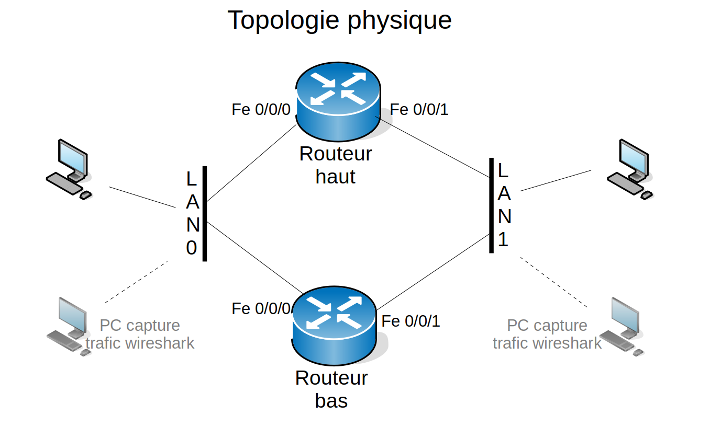

Ce document est sous licence Creative Creative Commons <br>
Attribution - Pas d’Utilisation Commerciale - Partage dans les Mêmes Conditions 3.0 France <br>
Merci de prendre connaissance de vos droits ici : [CC BY-NC-SA 3.0 FR](https://creativecommons.org/licenses/by-nc-sa/3.0/fr/)

# TP VRRP et HSRP sur routeurs CISCO

## Objectifs du TP
1.  Comprendre le fonctionnement de protocole de redondance "d'accroche" 
2.  Utilisation de VRRP et HSRP

## Présentation du TP

Ce TP a pour but d'illustrer le fonctionnement de VRRP et HSRP dans un cas simple. 
Nous avons vu que les protocoles HSRP et VRRP étaient utilisés afin de mettre en place une redondance pour un routeur. 
Nous allons illustrer ce point avec une topologie simple à redonder.


## 1. Topologie

Le besoin est le suivant : interconnecter 2 réseaux par un routeur, en mettant en place des redondances.
Avant toute chose, il faut définir la redondance et décider comment la mettre en place. 
Comme il y a 2 accès à redonder, nous utiliserons une redondance de type HSRP pour l'accroche du LAN 0 et une redondance de type VRRP pour l'accroche du LAN 1.



## 2. Mise en place

Nous imposons que le routeur haut soit maître pour le LAN 0 et le routeur bas maître pour le LAN 1. 
De plus, nous imposerons la préemption dans les réglages pour forcer la reprise de la position maître.
(La préemption est désactivée par défaut sur HSRP)
Pour ce TP, vous adresserez les équipements en utilisant les réseaux suivants:
LAN 0 : **10.*i*.100.0/24** avec adresse IP routeur virtuel **10.i.100.250**
LAN 1 : **10.*i*.101.0/24** avec adresse IP routeur virtuel **10.i.101.250**
avec *i* = numéro ilot 
Sur papier :
* Réalisez le plan d'adressage de votre topologie physique.
* Réalisez le plan d'adressage de votre topologie logique 


## 3. Configuration et Lancement des machines

Vous pouvez maintenant démarrer toutes vos machines, les adresser et leur affecter une route par défaut vers l'adresse IP virtuelle.
Pour observer les échanges protocolaire vous mettrez en place un port miroring sur les switch.
Vous adresserez également les routeurs et ensuitre vous mettrez en place une redondance.

En cas de problème sur les routeurs CISCO, pour réinitialiser la configuration par défaut :
```
erase startup-config
reload
no
```

## 4.  Test de la configuration

Une fois la configuration mise en place, vous pourrez tester le niveau de la redondance ainsi que sa rapidité
de convergence. 
Pour ce faire, nous utiliserons simplement un **ping entre les 2 machines**. 
Pour simuler les pannes, nous débrancherons simplement les câbles des interfaces.

Sur wireshark, observez :
* les échanges protocolaires
    * adresse multicast utilisée 
    * adresse MAC virtuelle
    * adresse IP virtuelle, priorité, id du groupe, etc. 
* les échanges après un changement de priorité

Sur les routeurs, observez :
* les différents états de redondance des routeurs
* la bonne prise en compte d'un changement de priorité
* la bonne prise en compte de la perte d'une interface

Dans l'état actuel, la redondance nous protège de la perte de quelle·s interface·s ?


## 5.  Amélioration

Le problème de l'architecture mise en place repose sur l'arrêt d'une des interface qui n'est pas redondée, sur le routeur maître. Ce problème n'est pas limité à cette configuration mais existe tout le temps. Pour contourner cette limitation, 2 solutions existent :
1. prévoir une liaison directe entre les 2 routeurs, pour passer de l'un à l'autre quand une liaison physique est hors d'usage (cela peut se faire par du routage dynamique ou par des routes statiques, qui auront de toute façon un poids inférieur aux routes directes)
2. faire du routage entre les interfaces des routeurs sur le LAN qui est protégé par redondance.
3. modifier dynamiquement la priorité d'une interface, d'après l'état d'un autre objet.

La solution 1 est celle qui procure le plus de résistance aux pannes. Elle permet notamment de prendre en compte tous les cas concernant une panne sur chaque LAN relié. La solution 2 n'est pas très appréciée : elle permet de mettre en place une configuration qui fonctionne pour toutes les pannes d'ordre 1, mais elle génère du trafic additionnel sur le LAN protégé (qui supporte déjà le trafic HSRP ou VRRP). De plus, il faut la configurer finement, pour éviter que des messages de type ICMP redirect ne viennent perturber le fonctionnement global de la redondance.
La solution 3 est plus légère. C'est elle que nous mettrons en oeuvre. Cela s'appelle le tracking.

--> Mettez en place un tracking des interfaces non protégées par la redondance et vérifiez la complège redondance de votre topologie


#### **_Commandes utiles_** 

**HSRP et VRRP**

*activation* 
Se placer en mode configuration, dans l'interface qui participe au groupe HSRP ou au groupe VRRP
Pour paramétrer le groupe **HSRP** et l'adresse du routeur virtuel, la commande est :  `standby <N° groupe> ip <@IP virtuelle>`
Pour paramétrer le groupe **VRRP** et l'adresse du routeur virtuel, la commande est : `vrrp <N° groupe> ip <@IP virtuelle>`

*priorité* 
Se placer en mode configuration, dans l'interface qui participe au groupe HSRP ou au groupe VRRP
Paramétrer le groupe **HSRP** avec sa priorité, la commande est : `standby <N° groupe> priority <priorité>`
La priorité doit être comprise entre 1 et 255 pour HSRP.
Pour paramétrer le groupe **VRRP** avec sa priorité, la commande est : `vrrp <N° groupe> priority <priorité>`
La priorité doit être comprise entre 1 et 254 pour VRRP. 
Le niveau 255 est réservé pour prendre en compte les routeurs qui ont comme adresse IP réelle l'adresse IP virtuelle.

*préemption* 
Se placer en mode configuration, dans l'interface qui participe au groupe HSRP ou au groupe VRRP
Pour régler les droits et délais de préemption, la commande **HSRP** est : `standby <N° groupe> preempt`
Pour régler les droits et délais de préemption, la commande **VRRP** est : `vrrp <N° groupe> preempt`

*statut*
Affichage de l'état HSRP
--> se mettre en mode PRIVILEDGED EXEC et la commande est `show standby`
Affichage de l'état VRRP
--> se mettre en mode PRIVILEDGED EXEC et la commande est `show vrrp <N° groupe>`
On peut limiter l'affichage à un groupe. Pour afficher l'état VRRP pour une interface donnée, il faut utiliser la commande :` show vrrp interface <interface>`

*tracking*
Nous nous limiterons au tracking des interfaces. 
La commande est alors : `track <N°objet> interface <interface> [line protocol | ip routing]`
exemple: `track 5 interface GigabitEthernet0/1  ip routing`
Le numéro d'objet permettra à un "client" d'utiliser les résultats du tracking (état de l'interface surveillée). On peut vérifier l'interface sur un plan opérationnelle (line protocol) ou sur un plan routage IP (ip routing).
Nous utiliserons la vérification sur un plan routage IP dans ce TP.

Ensuite, se placer en mode de configuration de l'interface du groupe en question et lier la priorité de l'interface au résultat du tracking
La commande HSRP est : `standby <N° groupe> track <N° objet tracked> [decrement <priorité>]`
Par défaut, la priorité est décrémentée de 10. On peut régler la valeur qu'il faut à cette priorité.
La commande VRRP est : `vrrp <N° groupe> track <N° objet tracked> [decrement <priorité>] `


**PORT MIRORING** 

Pour déclarer le port d'écoute, la commande est : `mirror-port <port_ecoute>`
Pour déclarer les ports écoutés (monitorés), la commande est : `interface ethernet <monitor_list> monitor`
Pour visualiser les réglages du port mirroring, la commande est : `show monitor`, qui permet d'afficher les réglages du point d'écoute.

