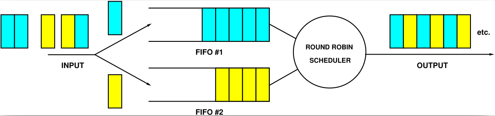
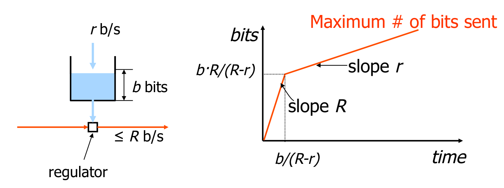
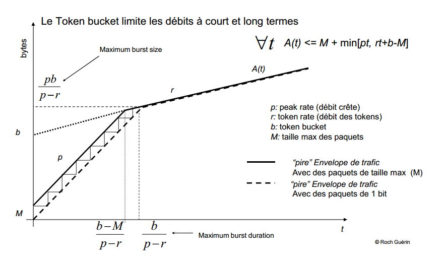
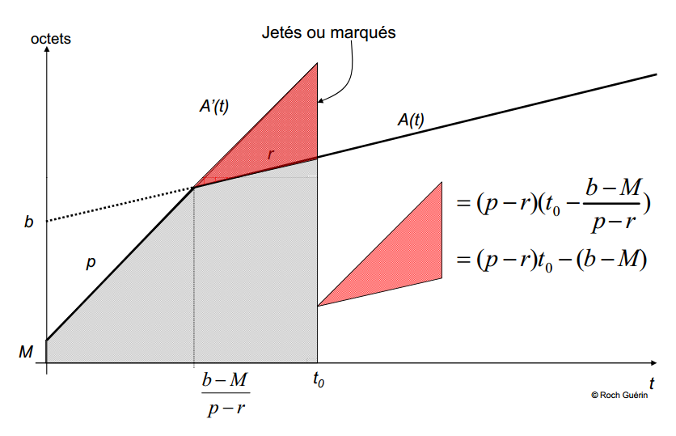
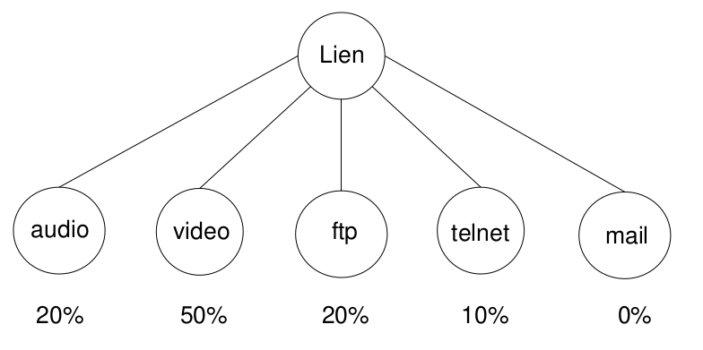
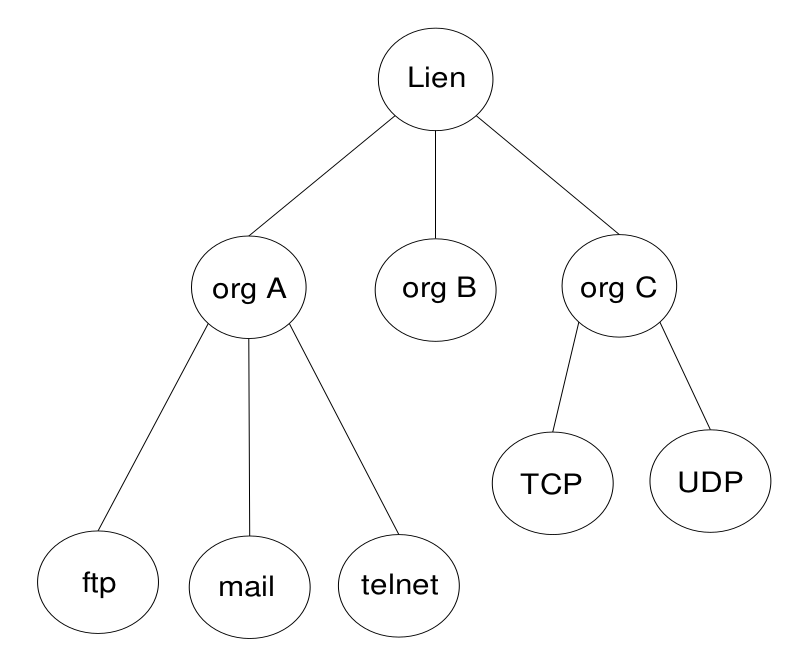
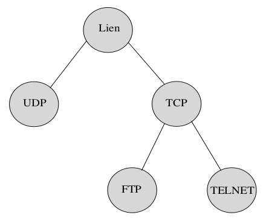

Ce document est sous licence Creative Creative Commons <br>
Attribution - Pas d’Utilisation Commerciale - Partage dans les Mêmes Conditions 3.0 France <br>
Merci de prendre connaissance de vos droits ici : [CC BY-NC-SA 3.0 FR](https://creativecommons.org/licenses/by-nc-sa/3.0/fr/)

## Slides du cours

Tout d'abord, visionner ces quelques slides d'introduction à la QoS qui introduisent votre TP.

[Cours d'introduction à la QoS en video sous-titrée](https://drive.google.com/uc?export=download&id=1_oWPrYkPmeTrj3jU_m8JTDozinSxeE4o)

<a href="https://drive.google.com/uc?export=download&id=1_oWPrYkPmeTrj3jU_m8JTDozinSxeE4o" title="Video player" frameborder="0" allow="accelerometer; autoplay; clipboard-write; encrypted-media; gyroscope; picture-in-picture" allowfullscreen>


Le reste des slides est disponible ci-dessous. Ils seront utilisés en partie pour introduire certains exercices et ajouter quelques compléments aux mécanismes présentés.

[Introduction à la QoS](Introduction_QoS.pdf)

## Déroulement du TP

Ce TP a pour objectif d'illustrer les principes de base des mécanismes de gestion de la QoS.
Nous travaillerons avec un **cahier de laboratoire** qui consiste en un fichier de collecte des résultats de vos expérimentations et qui contiendra vos notes et vos éventuelles captures d'écrans. Vous pouvez choisir l'éditeur de votre choix (LibreOffice, Word, Latex, ...) pour réaliser ce cahier qui devra être soumis au format PDF. 

Dans la suite, lorsqu'il sera question de :

* machine hôte ou terminal maître, nous parlerons d'un terminal ou de la machine qui aura été lancée en dehors de Gonetem;
* machine virtuelle, hôte virtuel ou terminal virtuel, nous parlerons d'un hôte ou d'un terminal obtenu sous Gonetem via `console SRC` ou SRC est le nom de l'hôte virtuel par exemple.

## Mise en place du banc de test pour le TP

Nous utiliserons la topologie de test suivante disponible [*ici*](qos.gnet).
```bash
SRC ------------------------------ RTR ------------------------------ DST
eth0:192.168.1.1/24               eth1: 10.0.0.254/8                  eth0:10.0.0.1/8
				  eth0: 192.168.1.254/24
```


Le routeur RTR est un hôte docker avec deux interfaces réseaux (et non pas FRR) sur lequel nous implémenterons les mécanismes de QoS.

Lancez votre scénario d'émulation et vérifiez tout d'abord que depuis la machine à gauche de cette topologie, vous "*pinguez"* la machine de destination à droite.  Le router RTR implémentera les mécanismes de QoS sur son interface de sortie `eth1` et les machines d'extrémités seront utilisées pour générer du trafic via `iperf3` ou simplement avec un `ping`.

## Introduction à Linux Traffic Control

Avant qu'un paquet IP ne quitte l'interface de sortie d'une machine, il passe par la couche Linux Traffic Control piloté par l'API TC. Ce composant est un outil puissant de planification, mise en forme, classification et hiérarchisation du trafic. Il est aussi utilisé pour émuler des liens avec des caractéristiques de délai et perte à des fins de tests via l'interface *Netem* que vous avez déjà utilisée l'an passé lors du TP sur TCP/UDP. 

Le placement inter-couches d Linux Traffic Control (LTC) est représenté ci-dessous :

```
Network layer                          +-------------+
                             +---------|   Routing   |---------------+
                             |         +-------------+               |
-----------------------------|---------------------------------------|--------------------------------
Link layer                   |                                       |
                             |         +-------------+        +-----------------+
   packet arrival -------<Bridge ?>----|  Bridging   | -------| Traffic Control |--------> send packet
                                       +-------------+        +-----------------+
```

Les paquets entrant sont examinés afin de déterminer si il sont destinés au noeud où ils se trouvent. Si c'est le cas, ils sont envoyés à la couche supérieure sinon, ils passent par la table de routage afin de déterminer quel est le prochain noeud à atteindre. Une fois l'opération faite, le routeur envoie les paquets vers une file d'attente sur l'interface de transmission. C'est sur cette interface que vont se jouer la QoS et le contrôle de trafic du noyau Linux; le contrôle de trafic étant implémenté juste avant que le paquet soit mis dans la file d'attente maintenue par le périphérique de sortie.

Le contrôle de trafic peut, entre autre, décider si le paquet est mis dans une file d'attente ou si il est jeté (ce cas peut survenir lorsque la file a atteint une taille limite ou si le trafic excède un débit seuil). Il peut également décider dans quel ordre les paquets vont être envoyés (afin de donner la priorité à certain flots) ou retarder l'envoi de paquets dans le but de limiter le trafic en sortie.

Les éléments nécessaires au LTC sont les suivants :
* La *queuing discipline* (*qdisc*) : ce sont les gestionnaires de file d'attente et les ordonnanceurs que nous allons détailler et expérimenter plus bas;
* Les *classes* : elles sont gérées par la discipline de file d'attente du périphérique. Une classe correspond à un ensemble de règles marquant les données propres à une classe. On pourrait, par exemple, avoir une classe limitant le taux des paquets à 1 Mbps pendant la journée et qui passe ce taux à 5 Mbps durant la nuit. Plusieurs *queuing discipline* peuvent être liées à des classes. Par défaut, si aucune discipline n'est stipulée, on utilise FIFO; 
* Les filtres (*classifiers*) : ils filtrent les paquets afin de les organiser dans des classes gérées par des disciplines de file d'attente. Plusieurs filtres sont disponibles comme le *route-based classifier*, *RSVP Classifier* et le *u32 classifier*. Les filtres de *firewalling* peuvent être également utilisés, on pourrait donc utiliser une règle `iptables` comme *classifier*. Les *route classifiers* classent les paquets en fonction de la table de routage. Les *u32 classifier* sont utilisés pour faire de la classification basée sur l'adresse IP de destination, l'adresse IP source, le port TCP/UDP de destination, le port TCP/UDP source, le champ TOS et Protocol. 
* Le *policing* : le but de la politique de trafic est de s'assurer que le trafic n'excède pas certaines bornes. 

Le composant de base du LTC est la gestion de file d'attente *qdisc* pour *queuing discipline*. L'implémentation la plus simple d'un *qdisc* est la discipline FIFO. Parmi les autres disciplines, nous commencerons par explorer le filtre TBF (*Token Bucket Filter*), qui met en forme le trafic ou, lisse le trafic, afin de se conformer à la fois à un débit de sortie et à une taille de rafale donnée.

Attention à ne pas confondre *queuing discipline* (file d'attente) et *scheduler* (ordonnaceur). Une *queuing discipline* est une file d'attente dans laquelle les paquets vont être stockés pour future émission. La file FIFO est la plus simple des *queuing discipline*. Un *scheduler* va quant à lui ordonnancer la sortie des paquets stockés dans une (virtuelle) ou plusieurs files (réelles) d'attente. Sur le schéma ci-dessous nous avons deux *queuing discipline* FIFO et un *scheduler* de type *round robin* (i.e., simple tourniquet) :


La commande `tc` offre de multiples fonctionnalités dont nous allons détailler certaines d'entre-elles plus bas. Consultez la page de manuel de `tc` (en faisant `man tc`) pour avoir un aperçu des options qui vous seront utiles. Vous trouverez tout en bas de cette page l'index des pages de chaque *qdisc* disponible par exemple pour RED : `tc-red`. 

### qdisc par défaut

Nous pouvons vérifier les *qdisc* instanciées par défaut sur vos interfaces réseaux en tapant la commande `tc qdisc show`.
Comme vous le constaterez, les terminaux virtuels de l'interface Gonetem n'ont aucune `qdisc` par défaut :

```bash
root@SRC:/# tc qdisc show
qdisc noqueue 0: dev lo root refcnt 2
qdisc noqueue 0: dev eth0 root refcnt 2
```

Dans le terminal de la machine hôte, vous verrez que la discipline par défaut est `pfifo_fast` (ou `fq_codel` en fonction de la version du noyau). Notez que vous pouvez également obtenir cette information via `ip link` (champs `qdisc` sur la seconde ligne ci-dessous) :

```bash
eleve@gonetem:~$ ip link show dev enp0s3
2: enp0s3: <BROADCAST,MULTICAST,UP,LOWER_UP> mtu 1500 qdisc pfifo_fast state UP mode DEFAULT group default qlen 1000
    link/ether 08:00:27:5f:84:a4 brd ff:ff:ff:ff:ff:ff
```
La *qdisc* par défaut consiste donc en une seule discipline de mise en file d'attente `pfifo_fast` qui ne contient aucune classe de trafic définie par l'utilisateur. Cette discipline de mise en file d'attente fonctionne comme un *priority queuing* avec des files FIFO et examine le champs TOS/DSCP pour hiérarchiser certains paquets. La sortie équivalente avec `tc` donne :

```bash
eleve@gonetem:~$ /usr/sbin/tc qdisc show dev enp0s3
qdisc pfifo_fast 0: root refcnt 2 bands 3 priomap  1 2 2 2 1 2 0 0 1 1 1 1 1 1 1 1
```
La sortie ci-dessus se lit comme suit (lisez la page de manuel correspondante `man tc-pfifo_fast` et `man tc-prio`: 

> l'interface `enp0s3` a une discipline de mise en file d'attente `pfifo_fast` (ou `fq_codel`) avec l'étiquette `0:` attachée à la racine (`root`) de son arbre de *qdisc*. Cette *qdisc* classe et donne la priorité de tous les paquets sortants de cette interface en mappant leurs valeurs IP ToS 4 bits (c'est-à-dire les 16 valeurs répertoriées) aux bandes de priorité natives 0, 1 ou 2. Le trafic dans la bande 0 est toujours servi en premier, puis la bande 1, enfin la bande 2. Dans une bande, tous les paquets sont envoyés de manière FIFO.

Sur d'autres noyaux le choix a été porté sur l'ordonnanceur FQ-Codel comme le montre cette sortie :

```bash
elochin@elochin-laptop:~$ tc qdisc show dev enp0s3
qdisc fq_codel 0: root refcnt 2 limit 10240p flows 1024 quantum 1514 target 5.0ms interval 100.0ms memory_limit 32Mb ecn 
```
Il faut donc faire attention à la *qdisc* par défaut et la supprimer si besoin.

### Hiérarchie des classes

Chaque interface possède une hiérarchie de *qdisc*. La première *qdisc* est attachée à l'étiquette `root` et les *qdiscs* suivantes spécifient l'étiquette de leur parent. Quelques exemples de hiérarchies sont présentées ci-dessous avec les étiquettes conventionnelles utilisées :

```bash
Default qdisc : 	root ---> qdisc pfifo_fast 0:
Single qdisc : 		root ---> qdisc myqdisc 1:
Chained qdiscs :	root ---> qdisc myqdisc_a 1: ---> qdisc myqdisc_b 2:
Classful qdiscs :	root ---> qdisc myclassfull_qdisc 1: -+--> myclass 1.1 ---> qdisc myqdisc_b 10:
                                                               \-> myclass 1.2 ---> qdisc myqdisc_b 20:
```

L'ajout d'une *qdisc* à la racine d'une interface se fait par `tc qdisc add` tandis qu'en utilisant `tc qdisc replace`, on remplace la configuration par défaut indiquée ci-dessus (même comportement avec `tc qdisc change`. Un `tc qdisc del` supprimera la hiérarchie complète et la remplacera par la valeur par défaut. A noter que certaines *qdisc* sont dites *classless* et d'autres *classfull*. Dans le premier cas, ces dernières ne peuvent être attachée qu'à la racine. Il n'est pas possible de les chaîner.

```bash
$ tc qdisc add dev eth0 root handle 1: my_qdisc <args>
```

Les disciplines de mise en file d'attente *classfull* peuvent être enchaînées, le trafic passant alors par les *qdisc* configurées en spécifiant l'étiquette de leur prédécesseur comme parent :

```bash
$ tc qdisc add dev eth0 root handle 1: myqdisc_a <args> 
$ tc qdisc add dev eth0 parent 1: handle 2: myqdisc_b <args>
```

Des disciplines permettent de classer et marquer le trafic. Dans ce TP nous utiliserons le marquage applicatif proposé par `ping` et `iperf3`. Chacune des classes de trafic peut être gérée d'une manière spécifique, via un *qdisc* enfant spécifique comme illustré ci-dessous :

```bash
$ tc qdisc add dev eth0 root handle 1: myclassful_qdisc <args>
$ tc class add dev eth0 parent 1: classid 1:1 myclass <args>
$ tc class add dev eth0 parent 1: classid 1:2 myclass <args>
$ tc qdisc add dev eth0 parent 1:1 handle 10: myqdisc_a <args>
$ tc qdisc add dev eth0 parent 1:2 handle 20: myqdisc_b <args>
```

### Changer la taille de la file d'attente

La précédente commande renvoie également une information sur la taille de la file d'attente `qlen 1000`. Cette taille n'est pas modifiable via l'interface `tc` mais via l'interface `ip`. En utilisant, par exemple : `ip link set dev enp0s3 txqueuelen 100`, vous changerez cette taille de 1000 à 100 paquets (plus de détails avec `man ip-link`). Cette opération s'avérera nécessaire pour le dimensionnement de vos *buffers* si vous utilisez certaines *qdisc* non paramétrables par `tc` comme c'est le cas avec `pfifo_fast`. Les autres *qdisc* permettent de changer la taille logique de la file grâce aux mots clé `limit` ou `latency` voir par exemple `man tc-red` ou man `tc-bfifo`.

## Comprendre et mettre en oeuvre la QoS avec TC

Nous allons maintenant expérimenter quelques *qdisc*.

### Priority Queuing - illustration du premier exemple du cours

Expérimentons un gestionnaire de priorité comme pour l'exemple du cours du partage entre WhatsApp et Youtube.

Nous allons pour cela utiliser la discipline `sch_prio ` qui est un ordonnanceur de priorité à 3 bandes et la version configurable de `pfifo_fast`. Sa syntaxe est la suivante :

```bash
tc qdisc ... prio bands NUMBER priomap P1 P2...
```

Par défaut le nombres de bandes (files d’attentes) est de 3 et la *priomap* a pour forme : `1 2 2 2 1 2 0 0 1 1 1 1 1 1 1 1`
Consultez la page de manuel de `tc-prio` pour comprendre à quoi correspond cette *priomap*. A l'intérieur de chacune de ces bandes, les règles FIFO (premier entré, premier sortie) sont appliquées. Cependant, tant qu'il y a un paquet en attente dans la bande 0, la bande 1 ne sera pas traitée. Il en va de même pour la bande 1 et la bande 2. Cet ordonnanceur possède implicitement 3 classes par défaut qui sont pré-déclarées; il n'est donc pas nécessaire d'instancier des classes. La classe 1 correspond à la file 0, la classe 2 à la file 1 et la classe 3 à la file 2. Ce n'est pas le cas pour d'autres ordonnanceurs que nous verrons plus bas tels CBQ ou HTB, qui eux nécessitent la déclaration de classes.

Il est possible de vérifier grâce à une commande de traçage de type : `tc -s class show dev <intf>` le chemin emprunté par les paquets au travers des files. Combiné à la commande `watch` (si installée) par exemple : `watch -n1 tc -s class show dev <intf>` vous permettra d'obtenir des statistiques toutes les secondes.

Pour illustrer l'exemple du cours, nous allons tout d'abord limiter le débit en sortie  de l'interface `eth1` du routeur RTR et y ajouter la discipline `prio` ainsi :

```bash
root@RTR:/# tc qdisc del dev eth1 root
root@RTR:/# tc qdisc add dev eth1 root handle 1: tbf rate 1mbit burst 32kbit latency 50ms
root@RTR:/# tc qdisc add dev eth1 parent 1: handle 2: prio
```
La première commande permet de s'assurer qu'aucune *qdisc* résiduelle n'est présente sur l'interface.

Une fois fait, vérifiez que votre configuration a bien été prise en compte avec `tc -d qdisc show` :

```bash
root@RTR:/# tc -d qdisc show 
qdisc noqueue 0: dev lo root refcnt 2 
qdisc noqueue 0: dev eth0 root refcnt 2 
qdisc tbf 1: dev eth1 root refcnt 2 rate 1Mbit burst 4Kb/1 mpu 0b lat 50.0ms linklayer ethernet 
qdisc prio 2: dev eth1 parent 1: bands 3 priomap  1 2 2 2 1 2 0 0 1 1 1 1 1 1 1 1
```

Nous n'utiliserons ni marquage, ni classification, celui-ci sera réalisé par l'application. Certains outils, comme `ping`, possède des options de marquage qui sont donc réalisés via l'API socket (i.e., `setsockopt(sockfd, IPPROTO_TCP, IP_TOS, ...)`) .

Notre trafic `ping` simulera notre trafic WhatsApp prioritaire. Suivant la documentation de `tc-prio` un marquage correspondant à nos attentes pourrait être `0x10` (consultez la page de manuel de `tc-prio` pour comprendre pourquoi). Nous utiliserons donc la commande suivante : 

```bash
root@SRC:/# ping 10.0.0.1 -Q 0x10
```

Ce qui nous permettra d'observer l'évolution du délai du `ping` en fonction de l'application de cette valeur. Il est également possible de marquer une génération de trafic iPerf de la même façon. Vous trouverez ci-dessous la syntaxe de génération d'un flot UDP de 20KB/s qui pourrait représenter un trafic audio :

```bash
root@SRC:/# iperf3 -c 10.0.0.1 -u -b20K -t 20 -S 0x10
```

 Pour observer la mise en oeuvre du *priority queuing* : 

1. depuis SRC générez un trafic TCP standard avec : `iperf3 -c 10.0.0.1 -i1 -t500`; 
2. ensuite dans une autre console lancez un *ping* **sans marquage** conjointement avec ce trafic : `ping 10.0.0.1`
3. observez l'évolution du délai du RTT; stoppez le ping et marquez le trafic avec `-Q 0x10`. Quelle est maintenant le RTT mesuré ? Expliquez pourquoi et vérifier la classification du trafic avec `tc -s class show dev eth1`;
4. stoppez le ping et lancez la génération d'un trafic UDP sur un autre port avec `iperf3` sans (i.e.,  `iperf3 -c 10.0.0.1 -u -b20K -p10000 -t 20`), puis avec marquage en ajoutant `-S 0x10`;
5. répondez aux mêmes questions que ci-dessus et reportez vos conclusions dans votre cahier de laboratoire.

### Fair Queuing

Nous allons illustrer le principe de partage équitable avec l'ordonnanceur Stochastic Fair Queuing. Dérivé de WFQ (Weighted Fair Queuing) présenté dans le cours, SFQ limite le nombre de file d'attente en agrégeant les flots grâce à un processus aléatoire. SFQ est une solution au problème de passage à l'échelle de WFQ. 

 Réalisez l'expérimentation suivante :

1. consultez la page de manuel de SFQ : `man tc-sfq` et lire uniquement la section ALGORITHM pour comprendre son fonctionnement;
2. nous n'utiliserons pas de paramètre optionnel pour ce test, regardez simplement comment mettre en oeuvre SFQ dans la section EXAMPLE de cette page de manuel;
3. de la même manière que pour le *priority queuing*, configurez un TBF avec les mêmes paramètres que précédemment. Ne rien ajouter d'autre pour l'instant;
4. générez un trafic TCP de en parallèle (option `-P` de `iperf3`) depuis SRC pendant 30 secondes et notez les débits moyens finaux obtenus. Calculez la moyenne et l'écart-type pour ces 5 flots, répétez l'expérimentation une fois et refaite le calcul;
5. attachez un SFQ au TBF précédemment configuré comme "fils" du TBF;
6. générez de nouveau un trafic TCP de 5 flots en parallèle depuis SRC pendant 30 secondes et notez les débits moyens finaux obtenus. Calculez la moyenne et l'écart-type pour ces 5 flots, répétez l'expérimentation une fois et refaite le calcul;
7. comparez vos résultats avec et sans SFQ. Qu'en concluez-vous, notez vos constatations dans votre cahier de laboratoire.

### Traffic Shaping

Le TBF consiste en un tampon, ou seau, constamment rempli par des éléments virtuels appelés jetons à un débit spécifique. La taille du seau correspond au nombre de jetons pouvant être stockés. L'émission d'un paquet consomme un jeton qui est alors supprimé du seau. On observe trois cas de figure :

* les données arrivent dans le TBF avec un débit égal au débit de génération des jetons. Chaque paquet entrant consomme un jeton et sort de la file sans délai;
* les données arrivent dans le TBF avec un débit plus petit que le débit des jetons. Seule une partie des jetons est supprimée au moment où les paquets de données sortent de la file d'attente, de sorte que les jetons s'accumulent jusqu'à atteindre la taille du tampon. Les jetons libres peuvent être utilisés pour envoyer des données avec un débit supérieur au débit des jetons standard, si de courtes rafales de données arrivent;
* les données arrivent dans le TBF avec un débit plus grand que celui des jetons. Ceci signifie que le seau sera bientôt dépourvu de jetons, ce qui provoque l'arrêt du TBF pendant un moment : nous sommes en situation de "dépassement de limite" (*overlimit* reporté dans les statistiques de la *qdisc*). Si les paquets continuent à arriver, ils commenceront à être éliminés.

L'accumulation de jetons autorise l'émission de courtes rafales de données sans perte en situation de dépassement de limite. Cependant, toute surcharge prolongée entraînera systématiquement le retard des paquets, puis leur rejet.

Les paramètres importants du TBF sont :

* `limit` ou `latency` : LIMIT est le nombre d'octets qui peut être mis en file d’attente en attendant la disponibilité de jetons. LATENCY spécifie le temps maximal (c'est la même chose on change juste la métrique utilisée) pendant lequel un paquet peut rester dans TBF en attendant la disponibilité de jetons;
* `burst` : taille du seau en octets (ne peut-être inférieur au MTU soit `1500b` ou `12Kbit`); 
* `rate` : paramètre de la vitesse de génération des jetons;
* `peakrate` : débit crête, utilisé pour spécifier la vitesse à laquelle la seau est autorisé à se vider. Nous n'utiliserons pas ce dernier paramètre dans nos expérimentations.

Supposons que l'on génère un trafic avec un simple *ping* en faisant varier la taille et la fréquence d'émission de paquets ICMP et en considérant négligeable la transmission du paquet (i.e., L/C=0), nous pouvons approximer le débit d'émission ainsi :

* taille du paquet (`-s`) : 1500 octets, inter-espacement (`-i`) : 1 sec => 1500 * 8 = 12Kbit/s;
* taille du paquet (`-s`) : 1500 octets, inter-espacement (`-i`) : 0.1 sec => 1500 * 8/0.1 = 120Kbit/s;
* taille du paquet (`-s`) : 1500 octets, inter-espacement (`-i`) : 0.01 sec => 1500 * 8/0.01 = 1.2Mbit/s (plus proche de 0.94Mbit/s).

 Expérimentons avec un TBF :

1. paramétrez un TBF sur l'interface de sortie du routeur avec :`tc qdisc add dev eth1 root handle 1: tbf rate 1mbit burst 1500b limit 1500b`;
2. lancez `tc -s qdisc show` pour obtenir les statistiques de la file. Réalisez un ping depuis SRC avec : `ping -s 1500 10.0.0.1` et consultez de nouveau `tc -s qdisc show` qu'observez-vous ? Quelle taille maximale devez-vous utiliser pour que votre `ping` fonctionne et pourquoi (pensez aux tailles des entêtes ICMP, IP, Ethernet) ?

Le retour de `tc -s qdisc show` renvoie la limite sous forme de latence, celle affichée avec la configuration précédente est nulle (`lat 0us`). En changeant la valeur de la limite avec `limit 5000b` par exemple, la valeur de la latence retournée par `tc -s qdisc show` passe à 28ms sur ma machine. Cette valeur se calcule de la façon suivante : 5000 bytes correspond à 3 paquets de 1500 plus 500 restant (limit = 3 * 1500 + 500). La délai de transmission d'un paquet est de L/C soit 1500b/1mbit/s soit 12ms. Si 4 paquets arrive, le premier sera servi et 2 paquets + 1/3 sera mis dans le tampon soit 7/3 * 12ms = 28ms. La formule générale (sans considérer la rafale) est donc (limit/L -1) * (L/C) ou L ici est la MTU.

 Reparamétrez votre TBF avec le débit et la limite suivant : `tc qdisc add dev eth1 root tbf rate 100kbit burst 1500b limit 5000b`. Quelles valeurs sont retournées par `tc -s qdisc show` lorsque vous faites un :

1. `ping 10.0.0.1 -s1458`
2. `ping 10.0.0.1 -s1458 -i 0.1`
3. `ping 10.0.0.1 -s1458 -i 0.01`

Il ne sera pas nécessaire de plonger plus en amont dans le fonctionnement de cette *qdisc* que vous utiliserez majoritairement pour limiter le trafic à un débit donné.

#### Pour aller plus loin

Pour ceux qui le souhaite et pour compléter le cours, voici trois schémas représentant l'action de l'ensemble des paramètres du TBF.

Principe général ou R est soit le *peakrate* soit la capacité en sortie de l'interface :



Courbe d'arrivée A(t) en fonction de l'ensemble des paramètres :



Représentation des paquets hors-profil :



## Discipline de partage de lien à partage de classes

Dans leur article [[CBQ]](https://www.icir.org/floyd/cbq.html), Sally Floyd et Van Jacobson proposent une architecture de partage de lien (*link sharing*) où le découpage de la bande passante peut être faite en prenant en compte :

* la famille de protocoles utilisés sur le lien;
* les types de trafics applicatifs (telnet, ftp, mail, ...);
* les différentes organisations partageant le lien.

Le Class Based Queuing (CBQ) est une architecture de partage de lien tout en restant une variation de WFQ. CBQ utilise également un tourniquet sur plusieurs files mais un *classifier* en amont de la batterie de file va s'intéresser à classer chaque paquet en fonction de sa classe dans sa file correspondante. Il n'y a donc plus de classification sur le flot. Grâce au *round robin* en sortie des files, on évite qu'une seule classe de trafic ne monopolise toutes les ressources.

Le but du *link sharing* est la classification de ces différents types de trafic afin d'opérer à un partage de la bande passante entre ces trafics comme illustré par la figure suivante :



Le partage peut également être hiérarchisé, entre diverses organisations par exemple, comme le montre la figure ci-dessous :



Une part de la bande passante est donc attribuée à chaque niveau. La gestion des files met en oeuvre les différentes variantes de gestion des listes de processus : priorité, temps partagé. En fait, pour les cas extrêmes il est utile de pouvoir considérer qu'un certain type de trafic peut-être éliminé. Les mécanismes de partage dans CBQ ne tentent pas de fournir un contrôle de congestion au niveau des feuilles de l'arbre (correspondant à une classe de trafic); ces mécanismes étant à implémenter par l'ordonnanceur général à l'entrée du réseau. La classification des trafics se fait selon différents critères : champs TOS, adresses IP source et/ou émetteurs, numéros de ports UDP ou TCP qui permettent d'identifier les flux. On distingue les applications à trafic temps réel ou les applications du type messagerie au trafic moins urgent. Ces modes de gestion sont plus ou moins extensibles à des réseaux importants. Le trafic est géré par une étiquette de TOS pour les datagrammes qui circulent de façon indépendante.

L'API TC propose deux algorithmes de mise en forme du trafic : `tc-cbq` et `tc-htb`. Le premier (CBQ) est le plus ancien tandis que Hierarchy Token Bucket (HTB) est une version plus rapide et plus simple à configurer. HTB consiste en un nombre arbitraire de TBF disposés hiérarchiquement. C'est celui que nous allons expérimenter.

 Consulter la page de manuel du HTB en tapant `man tc-htb` dans un terminal Linux et prenez connaissance des paramètres `prio`, `rate`, `ceil` et `burst`.

#### Explication de l'option`ceil`

Comme déjà souligné précédemment, un lien doit pouvoir en cas de congestion recevoir la capacité minimum qui lui est alloué. Ce sont ces deux mots clés qui permettent justement de mettre en oeuvre cette hypothèse. Prenons la répartition suivante :

| Protocole | Pourcentage de bande passante allouée |
| :-------: | :-----------------------------------: |
|    UDP    |                  50%                  |
|    TCP    |                  50%                  |
|  Telnet   |                  25%                  |
|    FTP    |                  25%                  |

Pour réaliser cette réparation je dois donc créer, comme il l'est montré sur le schéma suivant, quatre classes HTB. 



Supposons que pour les deux classes TCP et UDP le trafic respectif des deux protocoles soit 20% et 60%. Si je paramètre le mot clé `ceil` de la classe UDP à 50% de la capacité totale, celui-ci n'ira pas chercher la capacité non utilisée par TCP et HTB limitera son débit de 60% à 50%. Dans le cas d'un `ceil` à 100%, celui ci pourra plafonner à 60% à condition que TCP n'augmente pas son trafic. En effet, si celui-ci passe à 50%, cela nous positionnerait dans un cas de congestion et dans ce cas, HTB partagerait équitablement le lien en 50/50.

Nous allons expérimenter HTB avec ce [script](htb-script.sh) également affiché ci-dessous : 

```bash
#!/bin/sh
DEV=eth1

# Initialisation
tc qdisc del root dev $DEV

# Limite la capacité du lien à 10Mbit/s
tc qdisc add root handle 1:0 dev $DEV tbf rate 10Mbit limit 3KB burst 3KB

# Attache un HTB à $DEV
tc qdisc add dev $DEV parent 1:0 handle 2:0 htb default 1

# Création de la classe racine
tc class add dev $DEV parent 2:0 classid 2:1 htb rate 10Mbit ceil 10Mbit

# Création des classe HTB à différents taux
tc class add dev $DEV parent 2:1 classid 2:2 htb rate 6Mbit ceil 10Mbit
tc class add dev $DEV parent 2:1 classid 2:3 htb rate 3Mbit ceil 10Mbit
tc class add dev $DEV parent 2:1 classid 2:4 htb rate 1Mbit ceil 10Mbit

# Création des filtres
# Filtre sur DPORT 5001 FLOWID 2:2
tc filter add dev $DEV parent 2:0 protocol ip prio 1 u32 match ip dport 5001 0xffff flowid 2:2
# Filtre sur DPORT 5002 FLOWID 2:3
tc filter add dev $DEV parent 2:0 protocol ip prio 1 u32 match ip dport 5002 0xffff flowid 2:3
# Filtre sur DPORT 5003 FLOWID 2:4
tc filter add dev $DEV parent 2:0 protocol ip prio 1 u32 match ip dport 5003 0xffff flowid 2:4
```

Les filtres sont très facilement paramétrables, il est par exemple possible de s'intéresser à l'adresse IP destination avec `match ip dst A.B.C.D` ou le protocole avec `match ip protocol 17 0xff` pour UDP ou encore `match ip protocol 1 0xff` pour ICMP. Pour mémoire, la numérotation des protocoles est donnée dans `/etc/protocols/`.

 A la lecture et analyse de ce script :

1. quelles sont les règles qui permettent de filtrer le trafic ?
1. tester le en générant du trafic TCP dans chacune des classes, tout d'abord dans la classe 1, puis 10 secondes après la classe 2, puis encore 10 secondes après la classe 3. Quels débit obtenez-vous dans chaque classe avant et après le demarrage respectif de chacune d'entre-elles ? 
1. modifiez le comportement des classes en changeant le paramètre `ceil` à la même valeur du `rate` afin d'en analyser l'impact;
1. modifiez et adaptez ce script afin de mettre en oeuvre le premier schéma de répartition (50% UDP, 50% TCP équitablement réparti en Telnet et FTP). Complétez votre cahier de laboratoire avec les résultats obtenus.

## Mise en oeuvre d'une architecture à QoS sur une topologie plus complexe 

TODO
