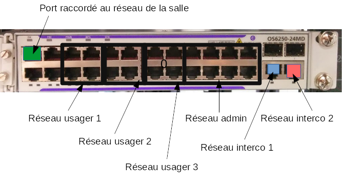

# Guide générale pour les TP

## Introduction

Ce document sert de guide pour tous les TP qui seront réalisés lors du stage RESO2. Il est structuré de la manière suivante :

* la premiere section présente l'architecture qui sera mis en place lors de stage ainsi que toutes les règles nécessaire pour la configuration de cette architecture;
* la seconde présente la configuration des switchs et des déports de la salle G19 pour le câblage du réseau réalisé durant ce stage;
- la troisième et dernière présente les commandes JUNIPER de base indispensables.

## Présentation de l'architecture

Cette partie présente l'architecture générale qui sera mise en oeuvre pour tout les TP du stage. Cette architecture sera mise en place lors du premier TP de la semaine. Il présente également toutes les règles à respecter pour configurer les équipements.


### Architecture

L'architecture à mettre en oeuvre est présentée dans la figure ci-dessous.

{width="15cm" height="15.21cm"}

Il s'agit d'une image réduite du réseau RENAR IP. Les sites suivants seront représentés :

* le CESNAC;
* 2 CRNA;
* 2 approches.

Suivant le nombre de participant au stage, l'architecture peut être simplifiée avec notamment la suppression de l'approche de Nancy.

Pour des raisons de logistiques, chaque site sera composé :

* d'un routeur M10i;
* d'un routeur M7i.

Cela permet d'avoir les deux routeurs d'un site dans la même baie.

**Répartition baie/site**

La répartition des sites sur les baies disponibles dans la salle G19 est
la suivante :

|        |                   |
|--------|-------------------|
| Baie 1 | CESNAC            |
| Baie 2 | CRNA/N            |
| Baie 3 | CRNA/E            |
| Baie 4 | Aéroport de Lille |
| Baie 5 | Aéroport de Nancy |


### Règles pour la réalisation de l'architecture

Cette partie liste toutes les règles à respecter pour la réalisation de cette architecture.

#### Nom des routeurs

Le nom des routeurs devra suivre la nomenclature suivante `<SIGLE_SITE>_<ID_ROUTEUR>` où : 

* `<SIGLE_SITE>` est un sigle de 3 lettres identifiant le site simulé :
  * **CES** pour le CESNAC
  * **CRN** pour le CRNA/N
  * **CRE** pour le CRNA/E
  * **LIL** pour l'approche de Lille
  * **NAN** pour l'approche de Nancy

* `<ID_ROUTEUR>` identifiant le routeur sur le site :
  * **1** pour le M7i
  * **2** pour le M10i

#### Utilisation des cartes FastEthernet / GigaEthernet {#utilisation-des-cartes-fastethernet-gigaethernet}

Comme pour RENAR-IP, les deux règles suivantes doivent être respectées :

1. les cartes FastEthernet ne sont utilisées que pour le raccordement des réseaux usagers;
1. les cartes GigaEthernet ne sont utilisées que pour les connexions inter-routeur.

#### Adresses IP internes au réseau

##### Loopback

L'adresse de loopback des routeurs sera construite de la manière
suivante : `192.168.<ID_SITE>.<ID_routeur>` où :

* `<ID_SITE>` identifie un site avec les valeurs suivantes :
  * 1 pour le CESNAC
  * 2 pour le CRNA/N
  * 3 pour le CRNA/E
  * 4 pour l'approche de Lille
  * 5 pour l'approche de Nancy

* `<ID_ROUTEUR>` idem que précédemment :
  * 1 pour le M7i
  * 2 pour le M10i

##### Interconnexion entre les deux routeurs du même site

Les interfaces utilisées pour réaliser l'interconnexion entre les deux routeurs du même site doivent être configurées avec une adresse IP de la forme suivante : `172.0.<ID_SITE>.<ID_ROUTEUR>`.

##### Interconnexions avec les autres sites

Les interfaces utilisées pour réaliser l'interconnexion avec l'extérieur du site doivent être configurées avec une adresse IP de la forme suivante : `172.<1-128>.<0-128>.<1-254>`.

L'approche proposée pour la construction des sous-réseaux est la suivante : `172.<ID_SITE1>.<ID_SITE2>.0/24` avec `<ID_SITE1>` l'identifiant du site le plus petit des deux. Pour la partie host de l'adresse, il est nécessaire de se mettre d'accord avec le routeur voisin.

#### Adresses IP usagers

Les interfaces des routeurs utilisées pour raccorder les réseaux usagers devront se terminer par :

* .253 pour les routeurs `*_1`;
* .254 pour les routeurs `*_2`.

## Utilisation des switchs et des déports de la salle

### Utilisation des switchs des baies RENAR IP

Chaque baie dispose d'un switch ALCATEL OS6250 qui sera utilisé :
* Pour l'interconnexion des routeurs inter-baies;
* Pour la mise en place des réseaux usagers.

#### Disposition du switch

La figure suivante présente la disposition des VLAN sur le switch :

* 2 ports sont dédiés pour interconnexion inter-baie (voir partie suivante pour plus de détail);
* 3 VLAN sont disponibles pour créer des réseaux usager;
* Le dernier VLAN sert pour l'administration des équipements réseaux (switch et routeur).

{width="15cm" height="8.07cm"}

#### Interconnexion inter-baie

##### Au travers des switchs

La salle et les baies ont été préconfigurés pour permettre des interconnexions inter-baie de manière simple, majoritairement au travers . Le tableau suivant référence les ports à utiliser suivant l'interconnexion qu'on souhaite résaliser.

|                    |                    |         |
|--------------------|--------------------|---------|
| Baie 1 - Interco 1 | Baie 5 - Interco 1 | VLAN 10 |
| Baie 1 - Interco 2 | Baie 2 - Interco 1 | VLAN 11 |
| Baie 2 - Interco 2 | Baie 3 - Interco 1 | VLAN 12 |
| Baie 3 - Interco 2 | Baie 4 - Interco 1 | VLAN 21 |
| Baie 4 - Interco 2 | Baie 5 - Interco 2 | VLAN 31 |

##### Connexions directes

Comme vous pouvez le voir sur le schéma d'architecture générale, certains sites nécessitent 3 interconnexions avec les autres sites alors que le switch ne permet que 2 interconnexions. C'est pour cela que **2 connexions directes** (i.e., en utilisant un câble Ethernet lo,g) doivent être mise en place :

* entre **la baie 1 et la baie 3**;
* entre **la baie 2 et la baie 4**.

#### Utilisation du mirroring

Lorsque vous aurez besoin de faire des captures de trafic avec wireshark, des ports du switch ont été configurés en mode mirroring. Ils sont présentés dans la figure suivante.

{width="15cm" height="5.519cm"}
<p align="center">                                Configuration du mirroring sur les switchs 6250</p>

## Configuration des routeurs JUNIPER

Cette section regroupe toutes les informations nécessaire à la configuration des routeurs JUNIPER. Elle se décompose en deux parties : 

* la première explique les grands principes pour configurer les routeurs JUNIPER;
* la seconde explique dans le détail comment se connecter aux routeurs JUNIPER et configurer concrètement les différents protocoles qui seront étudiés lors de ce stage.

### Principe générale de l'interface de configuration en ligne

#### Modes opération et configuration

L'interface de configuration en ligne basée sur les routeurs JUNIPER est composé de deux modes de fonctionnement :

1. le mode **opération** qui permet d'interagir avec le routeur pour connaître son statut;
1. le mode **configuration** qui permet de modifier la configuration du routeur.

Par défaut, lorsque vous entrez dans l'interface de configuration vous êtes en mode **opération** (qui se traduit par le caractère `>` à la fin du prompt). Pour passer en mode configuration, il suffit d'entrer la commande suivante : `configure`.

Le mode configuration se traduit par l'apparition du caractère `#` à la fin du prompt. Pour repasser en mode opération, il vous suffit de taper la commande `exit`. 

A noter qu'il est possible d'executer une commande du mode opération dans le mode configuration en faisant précéder celle-ci de `run` (équivalent du `do` avec CISCO). Exemple : `run show configuration`.

#### Auto-complétion et aide

L'interface de configuration supporte la complétions des commandes (obtenu avec l'utilisation de la touche TAB). De même, lorsque qu'on connaître les commandes disponibles, on peut entrer le caractère `?`.

**ATTENTION** : contrairement aux routeurs CISCO, on ne peut pas utiliser de commande abréger (comme `sh` à la place de `show` par exemple).

#### Mode opération

Le mode opération des routeurs JUNIPER est très proche de celui des routeurs CISCO (atteint après la commande `enable`). Toutes les commandes permettant de monitorer l'état du routeur commence par la commande `show`. Par exemple, la commande pour connaître en détail l'état des interfaces des routeurs est :

`show interfaces detail`

De plus, dans le mode opération, d'autres commandes sont disponibles tel que la commande `ping` ou `traceroute`.

#### Mode configuration

Ce mode permet de modifier la configuration. Le principe de configuration est très différent des routeurs CISCO. Les points clé à retenir sont détaillés ci-après.

##### Visualisation et structure de la configuration

Pour visualiser la configuration actuelle du routeur, il suffit simplement de taper la commande suivante en mode configuration :
```
show
```

Comme vous pourrez le voir, la configuration est structuré en bloc, un peu à la manière d'un code informatique.

A l'aide de la commande `edit`, vous pouvez rentrer dans une partie spécifique de la configuration, comme par exemple :

```
edit protocols ospf4
```

qui permet de rentrer dans le bloc de configuration liée à OSPF en IPv4. Si vous tapez la commande `show` vous ne voyez alors que la configuration liée à ce bloc. De même, à partir de là, vous ne pouvez modifier que la configuration de ce bloc.

Pour remonter au plus au niveau de configuration, il suffit de taper la commande :

```
top
```

Si vous souhaitez remonter uniquement d'un niveau, il suffit de taper :

```
up  
```

##### Modification de la configuration

Pour ajouter une nouvelle ligne de configuration il faut utiliser la commande `set`. De même pour supprimer un bloc de configuration, il faut utiliser la commande `delete`.

##### Prise en compte des modifications

Contrairement aux routeurs CISCO, les modifications de configuration ne sont pas prises à la volée. Pour qu'elles soient prises en compte, il faut absolument rentrer la commande :

```
commit
```

qui active la nouvelle configuration si elle est correcte et renvoie une erreur dans le cas contraire. Ce principe de `commit` permet de revenir en arrière à l'aide de la commande :

```
rollback
```

### Connexion et configuration

#### Connexion aux routeurs

La connexion au routeur se fera au travers du protocole `telnet`.  Chaque routeur de la salle dispose d'une interface dédiée à pour son administration. Cette interface est déjà configurée et raccordé au réseau d'administration de la salle (voir l'encart suivante pour connaître l'adresse IP à utiliser). Les identifiants pour la connexion sont :

* nom d'utilisateur : `juniper`;
* mot de passe : `Juniper`.

#### Adresse IP pour l'administration des routeurs

L'adresse IP à utiliser pour se connecter au routeur est : `192.168.19.1<NUM_baie><ID_routeur>` avec :

* `<NUM_baie>` étant le numéro de baie;
* `<ID_routeur>` valant 2 pour le M7i et 3 pour le M10i.

Par exemple, le routeur M7i de la baie 3 est accessible à l'adresse `192.168.19.132`.

#### Nommage des interfaces

Sur les routeurs JUNIPER de la salle G19 :

* l'interface de Management se nomme `fxp0`;
* les interfaces Gigabit sont nommées `ge-0/0/X` avec `X` l'identifiant du port (écrit sur la carte);
* sur les M7i, les interfaces FastEthernet sont nommées `fe-1/3/X` avec `X` l'identifiant du port (écrit sur la carte);
* sur les M10i, les interfaces FastEthernet sont nommées `fe-0/1/X`.
