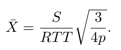
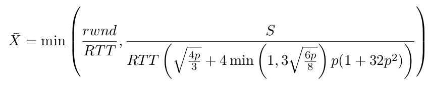

Soit une connexion TCP NewReno qui traverse un réseau où les paquets sont jetés aléatoirement de façon uniforme avec une probabilité *p*. Soit *RTT*, le temps aller-retour de la connexion et *rwnd* la fenêtre annoncée du récepteur. On notera *S* la taille des paquets TCP en octets avec *S=500B*. Le seuil du *slowstart* (`Agent/TCP set max_ssthresh_`) au début de la connexion est égal à *rwnd* et l'option DelAck est activée. L'objectif de cette simulation est d'étudier les performances de TCP dans un tel scénario, en particulier lorsque nous changeons la probabilité de perte de paquets *p*.

Deux approximations existent pour le débit TCP en présence de pertes aléatoires. La première, appelée *square root formula*, ne tient pas compte des délais d'attente, ni de *rwnd* et est formulée ainsi :

<div align=center></div>

La seconde plus complète et plus complexe à calculer est appelée PFTK (du mon de ses auteurs) est à la forme suivante :

<div align=center></div>

Vous trouverez ici : [pftk.gp](data/pftk.gp) un script gnuplot qui trace ces deux courbes pour un RTT donné. N'oubliez pas de changer la valeur du RTT pour analyser vos résultats par la suite. Votre travail sera de valider ces deux expressions à l'aide de simulations ns-2.

Construisez une topologie réseau très simple de deux noeuds $S$ et $D$ avec les paramètres suivants :
```
$ns duplex-link $S $D 1Mb 100ms DropTail
$ns queue-limit $S $D 10000
```
Rappels :

* pour TCP Newreno : `set tcp [new Agent/TCP/Newreno]`
* pour utiliser DelAck : `set sink [new Agent/TCPSink/DelAck]`
* pour changer la taille des paquets : `$tcp set packetSize 500`

Utilisez la procédure `monitor-queue` (présente dans le script `aqm.tcl` du précédent TP) pour calculer le taux d'occupation de la file d'attente d'un routeur.
Enfin Je vous rappelle qu'il est possible de fixer la taille d'une file d'attente en nombre de paquets (ici 100) de la façon suivante : `$ns queue-limit $S $D 100`

**Questions**

1. Quel est le [<font color = "blue">produit délai de bande passante</font>](https://en.wikipedia.org/wiki/Bandwidth-delay_product) d'un tel réseau ? Définissez la fenêtre du récepteur et le seuil du *slowstart*  à ce produit.
2. Ajoutez le code qui vous permet de tracer la taille de la fenêtre en fonction du temps. Tracez l'évolution de cette fenêtre en utilisant gnuplot
3. Ajoutez un modèle d'erreur entre S et D :
```
set lossModel [new ErrorModel]
$lossModel set rate value-of-p
$lossModel unit packet
$lossModel drop-target [new Agent/Null]
$set lossyLink [$ns link $S $D]
$lossyLink install-error $lossModel
```
Tracez la fenêtre de congestion de la connexion TCP pour p=10^-4 et p=10^-2. Interprétez les résultats.

4. Changez la probabilité de perte p entre 5.10^-5 et 5.10^-1. Pour chaque probabilité, calculez l'utilisation du lien par la simulation, l'utilisation donnée par la formule racine carrée et l'utilisation donnée par la formule PFTK. Comment les performances de TCP varient-elles lorsque p augmente ? Expliquez.
5. Laquelle des deux formules se rapproche le mieux du débit de TCP ?
6. Dans quel cas pouvons-nous considérer que la formule de la racine carrée est une bonne approximation du débit TCP ?
